<p align="center">
    <h1>Introduction to OpenGL and Rust</h1>
</p> 

> <p align="center"><h6>Sivert Utne - 8. September 2021</h6></p>

### Tools needed:
- git
- rustc		
- cargo

## Task 0: Preperation
The boilerplate project is cloned with:

```sh
git clone https://github.com/pbsds/gloom-rs
```

Compiling and running the project with `cargo run` gives us the following window.

<p align="center">
	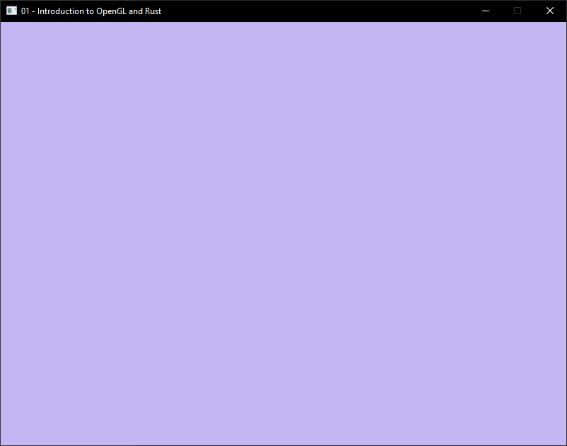
</p>


## Task 1: Drawing your first triangle

### a) Create a function which sets up a Vertex Array Object (VAO) containing triangles. 

- The function must take a vector of three dimensional vertex coordinates (usually `&Vec<f32>`) and an array of indices (`&Vec<u32>`).
- The function must return the integer ID of the created OpenGL VAO set up, to draw the input arrays.
- The contents of the buffer can be assumed to exclusively contain triangles, specified by floating point coordinates.

```rust
unsafe fn initialize_vao(
    vertices: &Vec<f32>,
    indices: &Vec<u32>,
) -> u32 {
    // Create Vertex Attribute Array
    let mut vao_id: u32 = 0;
    gl::GenVertexArrays(1, &mut vao_id);
    gl::BindVertexArray(vao_id);

    // Create and fill Vertex Buffer Object
    let mut vbo_id: u32 = 0;
    gl::GenBuffers(1, &mut vbo_id);
    gl::BindBuffer(gl::ARRAY_BUFFER, vbo_id);
    gl::BufferData(
        gl::ARRAY_BUFFER,                   // Target
        util::byte_size_of_array(vertices), // Size
        util::pointer_to_array(vertices),   // Data
        gl::STATIC_DRAW,                    // Usage
    );

    // set vertex attributes
    let vertex_attrbute_index: u32 = 0;
    gl::VertexAttribPointer(
        vertex_attrbute_index,      // Index
        3,                          // Size
        gl::FLOAT,                  // Type
        gl::FALSE,                  // Normalized
        util::size_of::<f32>() * 3, // Stride
        util::offset::<c_void>(0),  // Offset
    );
    gl::EnableVertexAttribArray(vertex_attrbute_index);

    // Create and fill Index Buffer Object
    let mut ibo_id: u32 = 0;
    gl::GenBuffers(1, &mut ibo_id);
    gl::BindBuffer(gl::ELEMENT_ARRAY_BUFFER, ibo_id);
    gl::BufferData(
        gl::ELEMENT_ARRAY_BUFFER,          // Target
        util::byte_size_of_array(indices), // Size
        util::pointer_to_array(indices),   // Data
        gl::STATIC_DRAW,                   // Usage
    );
    return vao_id;
}
```


### b) In the handout code, you’ll find a basic shader pair in the folder “shaders”. Load and link the pair, then activate it.

```rust
let shader = shader::ShaderBuilder::new()
	.attach_file("./shaders/simple.vert")
	.attach_file("./shaders/simple.frag")
	.link()
shader.activate();
```


### c) Define and instantiate a VAO containing at least **5 distinct triangles** using the function you defined in *a)*. Use the shader pair you loaded in *b)* to render the VAO.
 > Hint: these coordinates will give a visible triangle when you perform the drawing correctly:

| x    | y 	  | z 	 |
|  --: | --:  | --:	 |
| -0.6 | -0.6 |  0.0 |
|  0.6 | -0.6 |  0.0 |
|  0.0 |  0.6 |  0.0 |

We can now use the coordinates above to create our first triangle with the following code:

```rust
let vertices: Vec<f32> = vec![
    -0.6, -0.6, 0.0, // Point 1
     0.6, -0.6, 0.0, // Point 2
     0.0,  0.6, 0.0, // Point 3
];
let indices: Vec<u32> = vec![0, 1, 2];
```

Running the code gives the following window (i changed the backgroundcolor):

<p align="center">
	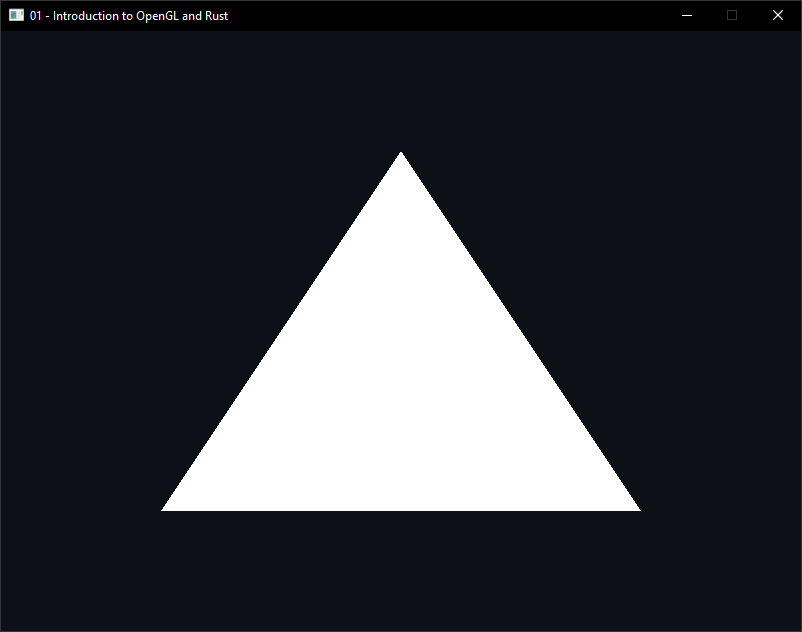
</p>

Expanding upon this (by adding more vertices and indices) to create 5 triangles we get:

<p align="center">
	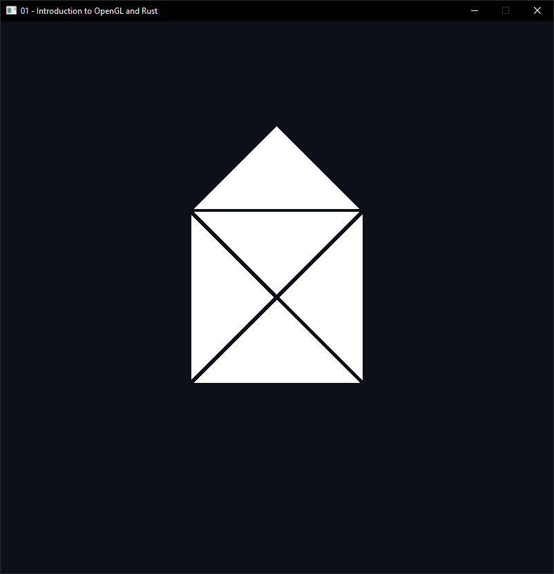
</p>


## Task 2: Geometry and Theory

### a) Draw a single triangle passing through the following vertices:

| x 	| y 	 | z 		|
|  --:| --:  | 	--:	|
| 0.6 | -0.8 | -1.2 |
| 0.0 |  0.4 |  0.0 |
|-0.8 |  0.2 |  1.2 |

Using the coordinates listed gives us the following image:

<p align="center">
	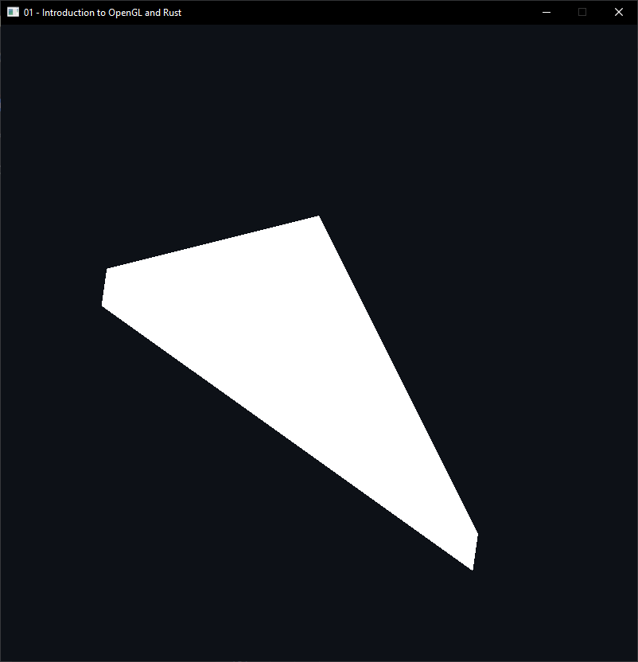
</p>

#### Explain in your own words:

#### i) What is the name of this phenomenon?   

What we are observing here is clipping.

#### ii) When does it occur?    

Clipping occurs when some of our triangle falls outside of the viewbox and isn't drawn.

It makes sense that we clip a triangle in the x- and y-direction because the triangle isn't longer inside the window. but what about the z-direction?

When the triangle is no longer resting on the x-y-plane it has depth. The camera is placed directly above the x-y-plane, and because we cannot draw into infinity we have to set a limit for how deep we are going to draw. The same happens when moving too close to the camera.

Below i have put together a small demonstration of how the triangle is clipped more and more when moving one of its corners closer to the camera. The left corner is first at `z=0.6`, then `z=1.2` and finally z=`1.6`. By doing this we can observe how by "lifting" the point closer (or "past") the camera, it streches the triangle more and more out of the viewingbox.

<p align="center">
	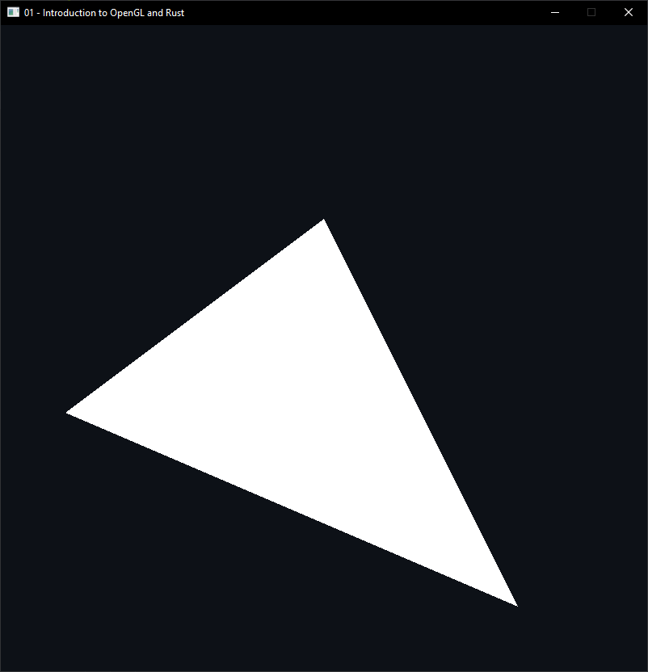
	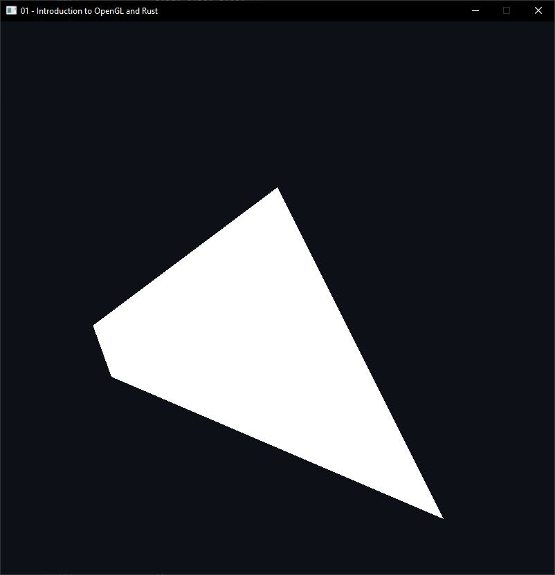
	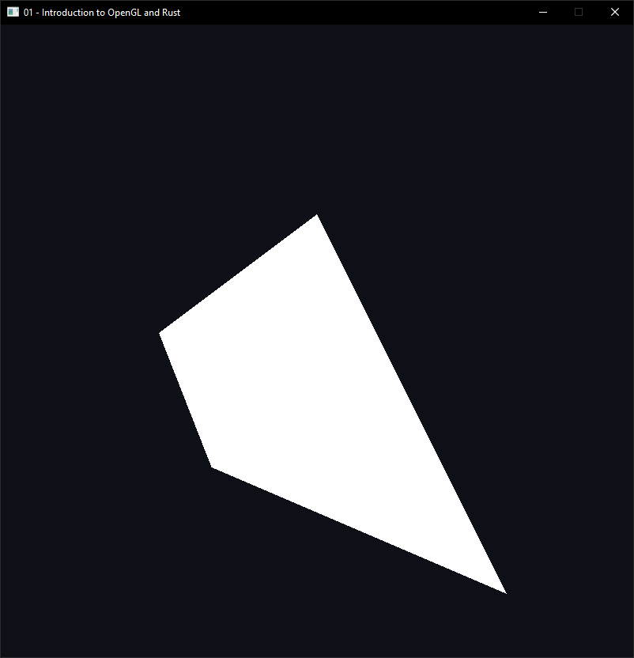
</p>

#### iii) What is its purpose?  

In order to show something on a screen, we are dependant upon selecting what each individual pixel is going to display. Clipping prevents us from trying to draw something outside of the screen, and trying to access a pixel that doesnt exist. The same goes for depth, as to render depth we need a depth buffer which cannot have unlimited size.


### b) While drawing one or more triangles, try to change the order in which the vertices of a single triangle are drawn by modifying the index buffer. A significant change in the appearance of the triangle(s) should occur. 

#### i) What happens?   

```rust
let vertices: Vec<f32> = vec![
		-0.5, -0.5, 0.0,
		 0.5,  0.0, 0.0,
		 0.0,  0.5, 0.0,
];
let indices: Vec<u32> = vec![0, 1, 2]; 
```
Using the coordinates and indices above, we get this triangle:

<p align="center">
	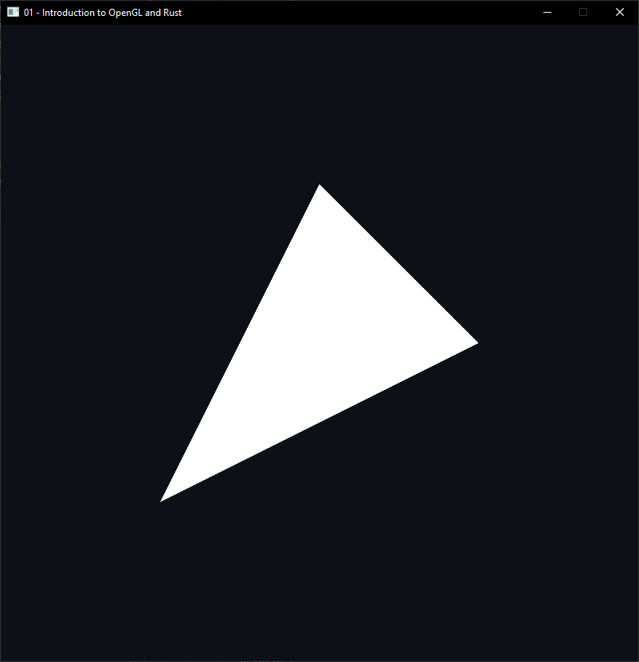
</p>

But if we reverse the indices like this:
```rust
let indices: Vec<u32> = vec![2, 1, 0]; 
```
we get the following window instead:  

<p align="center">
	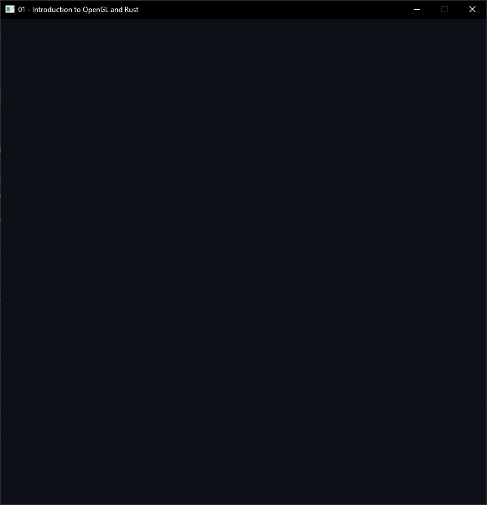
</p>

We notice how it appears that the triangle has disapeared, even though the vertices are in exactly the same position.

#### ii) Why does it happen?    

This happens because we are actually looking at the "back" of the triangle. Normally we are used to objects being visible from all directions, but the triangle we are drwing here actually only has one (visible) side. One can think of this as if we are drawing the triangle on a piece of paper, we can only actually see the triangle if we look at the paper from the "correct" side. When viewing the triangle from the back, it isn't rendered.

This is called *back-face culling*.  

This is done because obviously there is no point in drawing the same triangle on both sides of a piece of paper, because we can only view it from one direction anyway. The same goes for computer graphics, it is a lot of unnecessary work to "draw" things we are not going to see. 


#### iii) What is the condition under which this effect occurs? Determine a rule.   

This happens based on the direction the coordinates are drawn. The reason for this is that we use the normal of the geometry to determine what is the front and back of the shape. To find the normal for a geometry, curl all your right-hand fingers (except the thumb) in the direction the vertices are drawn. Your thhumb will then point in the direction of the shapes normal vector.

Doing this we quickly see how if we draw the vertices counter-clockwise the normal will be towards us (the camera), and be drawn. Drawing the vertices clockwise will make the normal go in the same direction as our view direction, and the shape isn't drawn.


### c) Explain the following in your own words: 

#### i) Why does the depth buffer need to be reset each frame?  

The depth buffer needs to be reset each frame because the fragments might have changed position, this change might have made fragments that previously were behind another one, now be in front instead. If the depth buffer isn't reset the fragment that is now in front might not be rendered because the depth buffer already says it should be behind something.

#### ii) In which situation can the Fragment Shader be executed multiple times for the same pixel?  

The fragment shader will be run multiple times for the same pixel if there are more than one fragment (in depth) at this pixel. An example of this could be in a game with water, where a pixel first will render what is behind the water, then add the water itself (which is probably transparent).

#### iii) What are the two most commonly used types of Shaders? What are the responsibilities of each of them?  

The two most common shaders are a vertex shader and a fragment shader. 

The vertex shader is responsible for translating/moving the vertices we are drawing (essentially moving the corners of our shapes).

The fragment shader is responisble for how the pixels between the vertices will appear. This means changing/setting colors etc. 

#### iv) Why is it common to use an index buffer to specify which vertices should be connected into triangles, as opposed to relying on the order in which vertices are specified in the vertex buffer(s)?  

The index buffer makes it possible to reuse the same points several times. For instance if one wants to make a cube, each of the 8 corners (vertices) will be used 6 times each (2 triangle for each of the 3 sides connecting to it). Without the index buffer you would instead need to store 48 points (where 42 are duplicates).

This makes it easier to manage the points, and also improves the performance from using less memory. 

#### v) While the last input of `gl::VertexAttribPointer()` is a pointer, usually a null pointer is passed in. Describe a situation in which you would pass a non-zero value into this function.    

This pointer functions as an offset from the startindex of the buffer. Meaning you normally pass a non-zero value here because you want to draw all the data from the buffer, if you however want to skip a part of the data, this is where you can do that.

### d) Modify the source code of the shader pair to:    

#### i) Mirror the whole scene horizontally and vertically at the same time.    

I start with the same triangle used to demonstrate back-face culling.

<p align="center">
	
</p>

To mirror the scene i use **simple.vert** (the vertex shader). The output of this shader is a vector with pixel coordinates. These coordinates range from -1.0 to 1.0, both vertically and horizontally. To mirror the scene i can simply invert the x- and y-values of the original position.

```rust
gl_Position = vec4( 
    - position.x, 
    - position.y, 
      position.z, 
      1.0f 
);
```

Running the code now we can see how the triangle has been mirrored both horizontally and vertically.

<p align="center">
	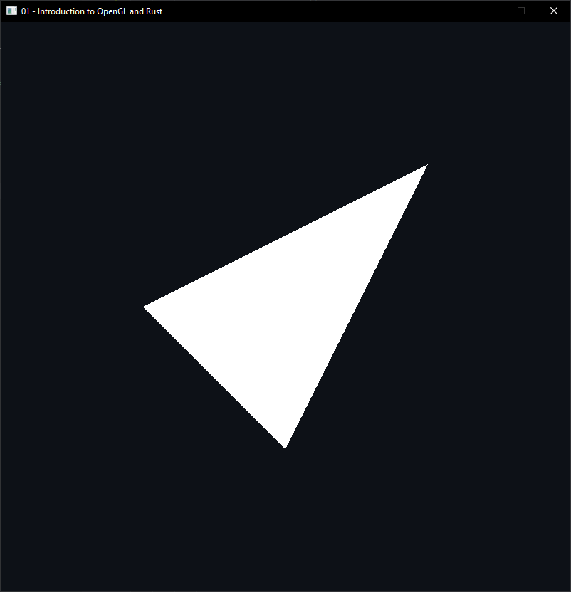
</p>


#### ii) Change the colour of the drawn triangle(s) to a different colour.  

Here i am using `gl_FragCoord` in **simple.frag** (the fragment shader) to define a color based on the position of the pixel. To do this i normalize the coordinates to fall between 0 and 1:

```rust
float x = gl_FragCoord.x / 800; 
float y = gl_FragCoord.y / 800;
```
I then set the color:
```rust
color = vec4(
    1.0 - x, // R
    1.0 - y, // G 
    1.0,     // B 
    1.0,                                           
);
```
And this is the result (using the same triangle from the previous task):

<p align="center">
	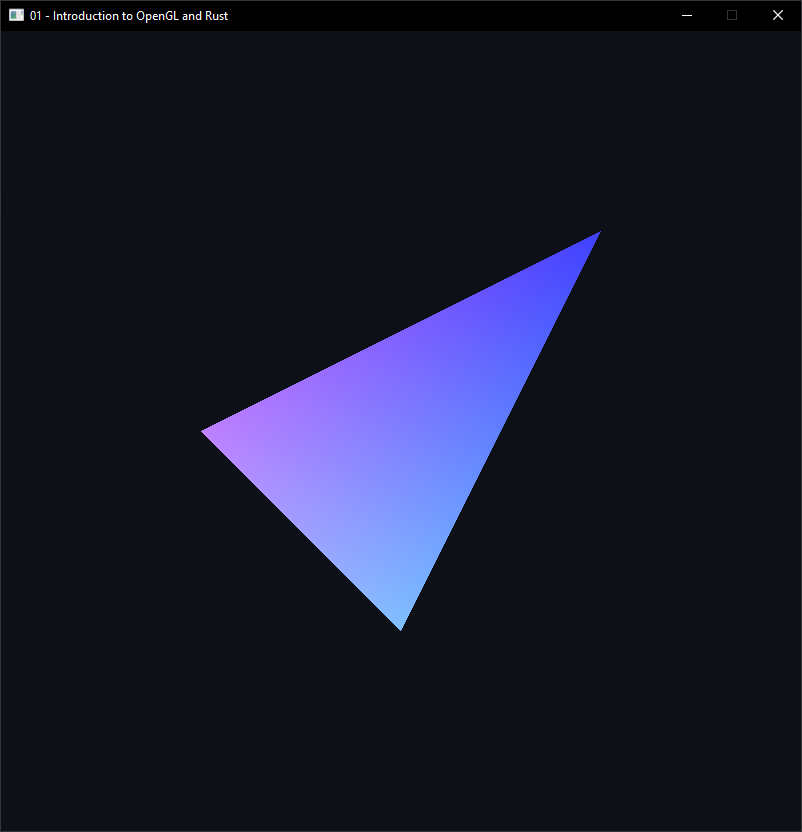
</p>


## Optional Bonus Challenges

### b) Draw a circle.   

Creating a circle using the drawing method `TRIANGLE_FAN`: 

<p align="center">
	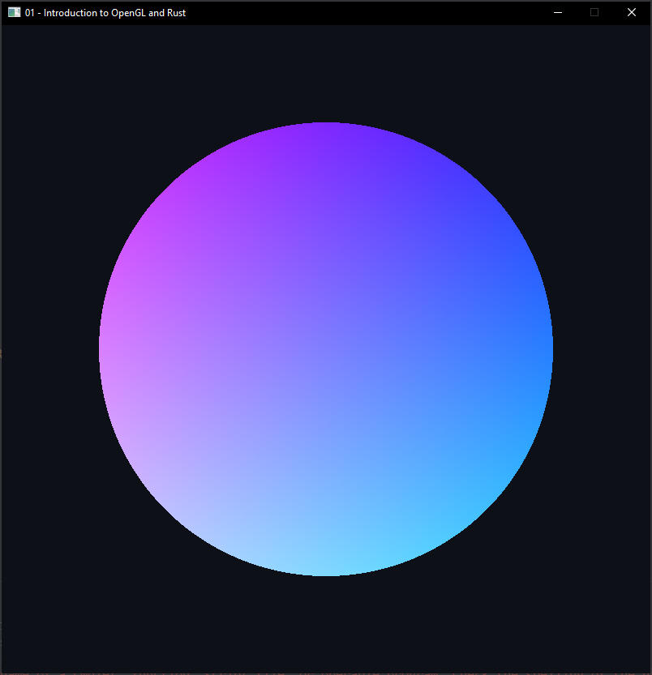
</p>


### a) Use gl_FragCoord to draw a checkerboard on  a triangle (or something similar).   

Adding a checkerboard pattern to the circle alreday created in *b)*:

<p align="center">
	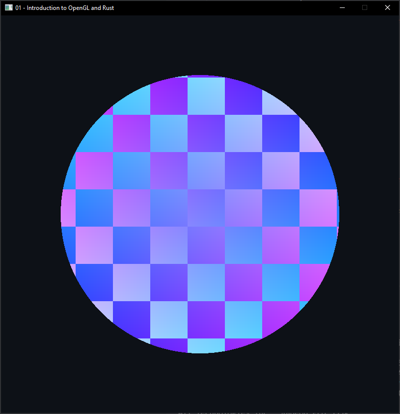
</p>
