# Transformations and Transparency
>>Sivert Utne - 24. September 2021

### Objective 
**Understand how multiplying a 4x4 matrix with single coordinates allows for a wide variety and combinations of transformations. Get a taste of combining transformations, and what the limits are of their possibilities.**

---

## Task 1: Repetition

#### **a)**
***In the previous assignment, you created a function in which converted a float (f32) and integer (u32) vector into a Vertex Array Object (VAO).***

##### *i)*
*Extend this function to in addition take another float vector as a parameter. This additional vector should contain color values - one RGBA color value per vertex. This additional float vector should be put into a Vertex Buffer Object, and attached to the VAO.*

```rust
let mut cbo_id: u32 = 0;
gl::GenBuffers(1, &mut cbo_id);
gl::BindBuffer(gl::ARRAY_BUFFER, cbo_id);
gl::BufferData(
    gl::ARRAY_BUFFER,                 // Target
    util::byte_size_of_array(colors), // Size
    util::pointer_to_array(colors),   // Data
    gl::STATIC_DRAW,                  // Usage
);

let color_attrbute_index: u32 = 1;
let nr_of_color_values = 4;
gl::VertexAttribPointer(
    color_attrbute_index,                        // Index
    nr_of_color_values,                          // Size
    gl::FLOAT,                                   // Type
    gl::FALSE,                                   // Normalized
    util::size_of::<f32>() * nr_of_color_values, // Stride
    util::offset::<c_void>(0),                   // Offset
);
gl::EnableVertexAttribArray(color_attrbute_index);
```

##### *ii)* 
*Modify the Vertex Shader and the Fragment Shader to use colors from the new color buffer as the colors of triangle(s) in the buffer. If vertices in the same triangle have been assigned different colors, colors should be interpolated between these vertices.*

**Vertex Shader**
```rust
layout(location=1) vec3 position;

layout(location=2) in vec4 in_color;
layout(location=2) out vec4 out_color;

void main() 
{ 
    gl_Position = vec4(position, 1.0f);
    out_color = in_color;
}
```
**Fragment Shader**
```rust
layout(location=2) in vec4 in_color;

out vec4 color;

void main()
{
    color = in_color;
}
```

#### **b)** 
***Render a scene containing at least 3 different triangles, where each vertex of each triangle has a different color.***

<p align="center">
  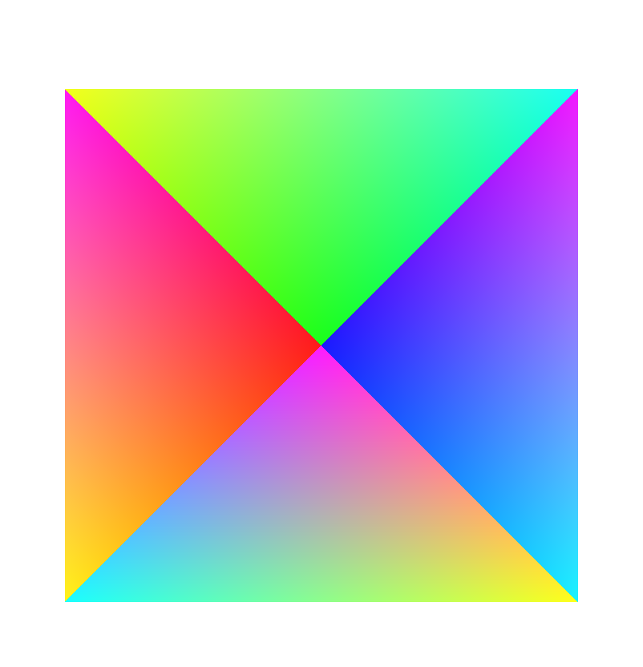
</p>

---

## Task 2: Alpha Blending and Depth 
***For this task, we want to show you what happens to a blended color when multiple triangles overlap from the camera’s perspective.***

#### **a)**
***Draw at least 3 triangles which satisfy the following conditions:***

- *There exists a section on the xy-plane on which all triangles overlap.*
- *For any single triangle, the three vertices of that triangle have the same z- coordinate.*
- *No two triangles share the same z-coordinate.*
- *All triangles have a transparent color (alpha < 1).*
- *All triangles have a different color.*
- *Each triangle’s vertices have the same color.*

<p align="center">
  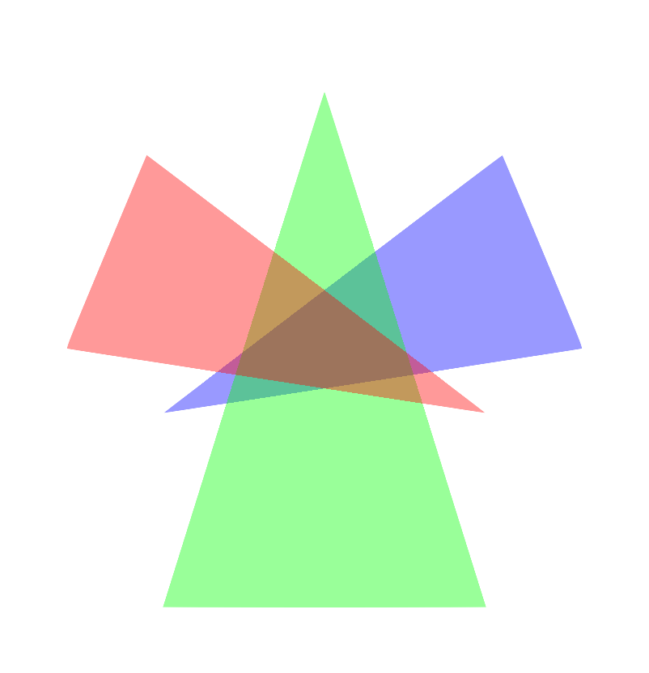
</p>

#### **b)**

##### *i)*
*Swap the colors of different triangles by modifying the VBO containing the color Vertex Attribute. Observe the effect of these changes on the blended color of the area in which all triangles overlap. What effects on the blended color did you observe, and how did exchanging triangle colors cause these changes to occur?*

<p align="center">
  
  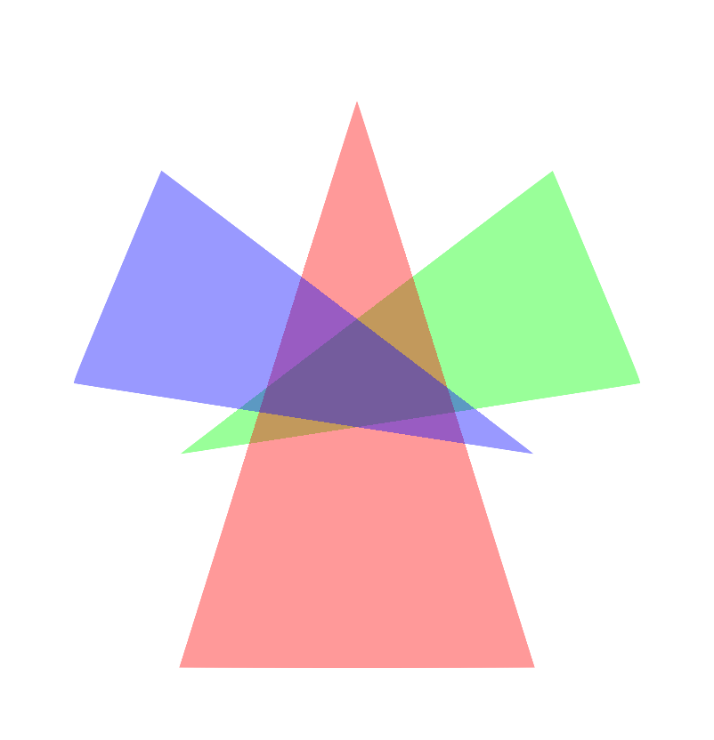
</p>

Lets compare the overlapping colors directly using their RGB values:
In the original, the center (where all triangles overlap) has the RGB values: 

- **(157, 116, 92)**

When we swapped the colors the values are: 
  
- **(116, 92, 157)**

The triangles are drawn with the same opacity. And we can directly see from the rgb values that the magnitude of the values are exactly the same (in ascending order: 92, 116, 157). The triangle in front will have the highest value, which means the triangle in the front will always have a larger impact on the final color than the triangles behind it.

##### *ii)*
*Swap the depth (z-coordinate) at which different triangles are drawn by modifying the VBO containing the triangle vertices. Again observe the effect of these changes on the blended color of the overlapping area. Which changes in the blended color did you observe, and how did the exchanging of z-coordinates cause these changes to occur? Why was the depth buffer the cause this effect?*

<p align="center">
  
  
</p>

These images show the triangles with a different amount of z-spacing between them (0.01 vs 0.99). And we can tell there is no diference in the color. This is because the distance does not matter in the formula for calculating the final color, only the color that is already present (with opacity), and the new color. 

<p align="center">
  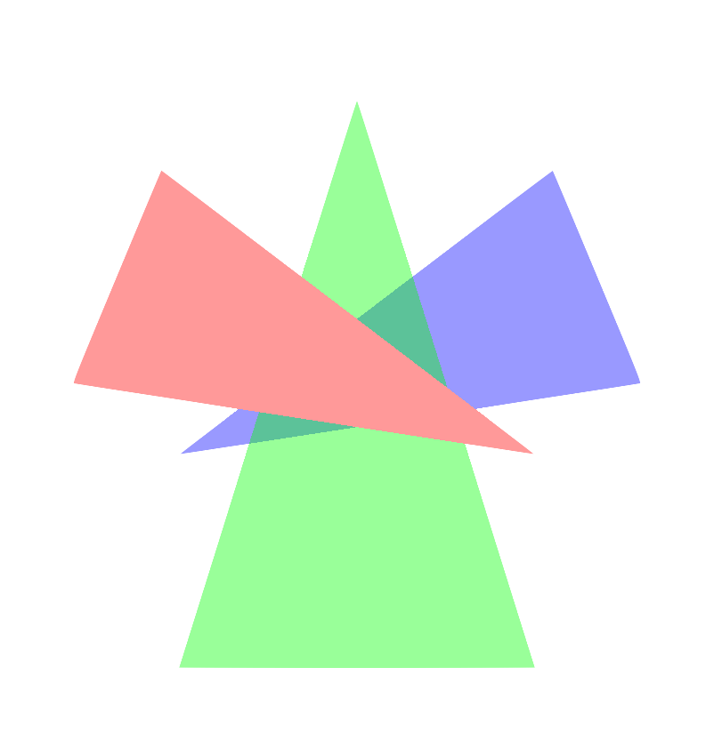
</p>

In this image i have swapped the z-coordinates so that instead of drawing the triangles in the order **blue > green > red** (back to front), they are drawn in the order **red > blue > green** (front-back-middle). Here we notice how the red triangle seems to not be transparent at all, because there is no blending.

This happens because of the depth buffer. We draw the red triangle first (which is in front of the others). So when we are attempting to draw the blue triangle, the depth buffer is telling us that there is "no need to draw here, something is covering it". The program therefore never actually attempts to draw anything behind our red triangle. 

We still see colorblending between the green and the blue triangles for the same reason. The blue was drawn first, so the depth buffer won't prevent us from drawing the overlapping section of the green triangle. The green triangle will also not attempt to be drawn under the red triangle.

---

## Task 3: The Affine Transformation Matrix

#### **a)**
***Modify your Vertex Shader so that each vertex is multiplied by a 4x4 matrix. The elements of this matrix should also be defined in the Vertex Shader. Change the individual elements of the matrix so that it becomes an identity matrix.***

```rust
mat4x4 identity_matrix = {
//row 0  1  2  3
    { 1, 0, 0, 0 }, // col 0
    { 0, 1, 0, 0 }, // col 1
    { 0, 0, 1, 0 }, // col 2
    { 0, 0, 0, 1 }, // col 3
};
gl_Position = identity_matrix * vec4(position, 1.0f);
```
> Note that because the matrices in GLSL are column major, the rows and columns are inverted when declaring the values (this doesn't matter for the identity matrix, but it does matter in part b).

#### **b)**
***Individually modify each of the values marked with letters in the matrix in equation 2 below, one at a time. In each case use the identity matrix as a starting point.***

***Observe the effect of modifying the value on the resulting rendered image. Deduce which of the four distinct transformation types discussed in the lectures and the book modifying the value corresponds to. Also write down the direction (axis) the transformation applies to.***

```rust
mat4x4 identity_matrix = {
    { a + 1, d + 0, 0, 0 },
    { b + 0, e + 1, 0, 0 },
    {     0,     0, 1, 0 },
    { c + 0, f + 0, 0, 1 },
};
gl_Position = identity_matrix * vec4(position, 1.0f);
```
When altering each letter to be equal 1 in the matrix i get the following results. (I also performed the same with a uniform variable to animate the effects). 


|`a = 1`| `b = 1`| `c = 1`|
|:-:|:-:|:-:|
|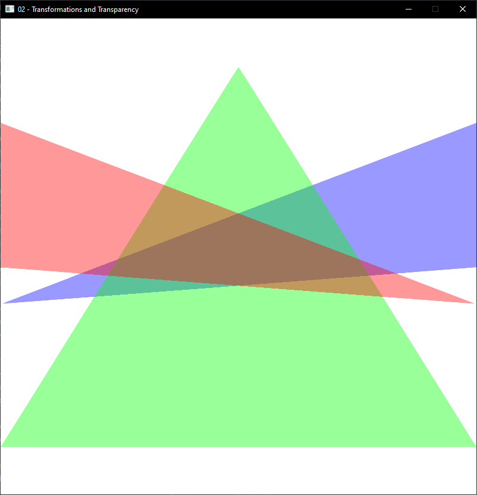 | 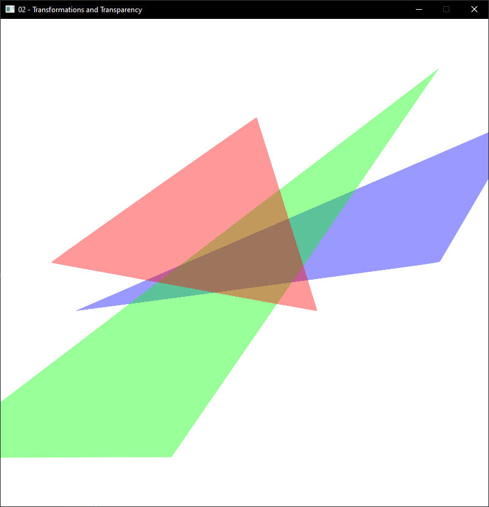| 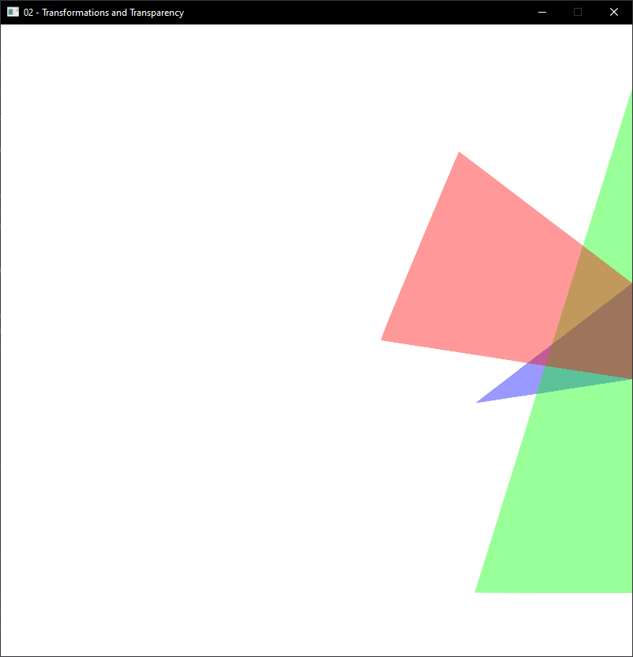|

| `d = 1`| `e = 1`| `f = 1`|
| :-:|:-:|:-:|
   |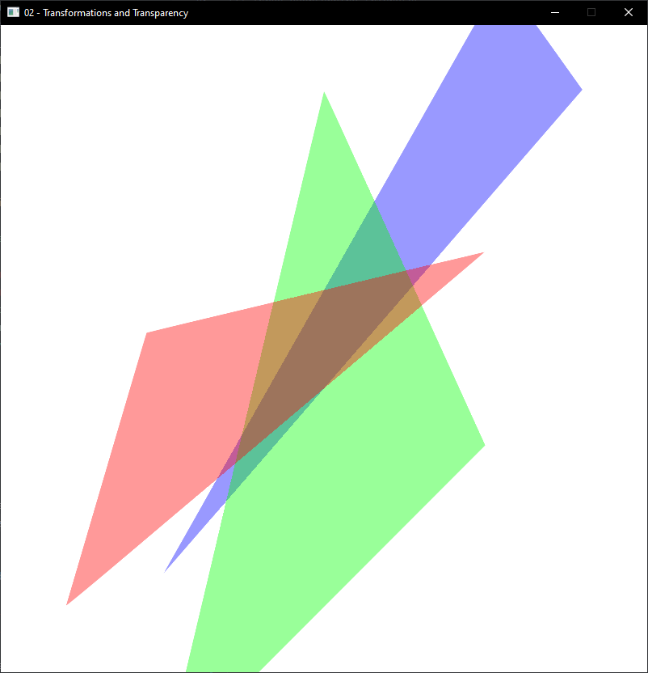| 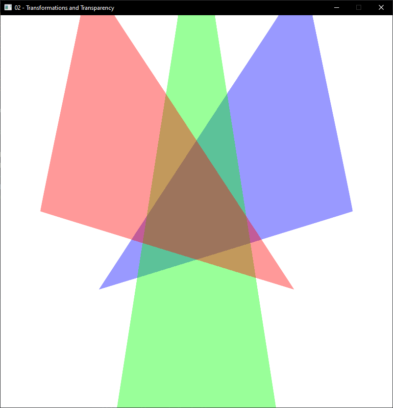| 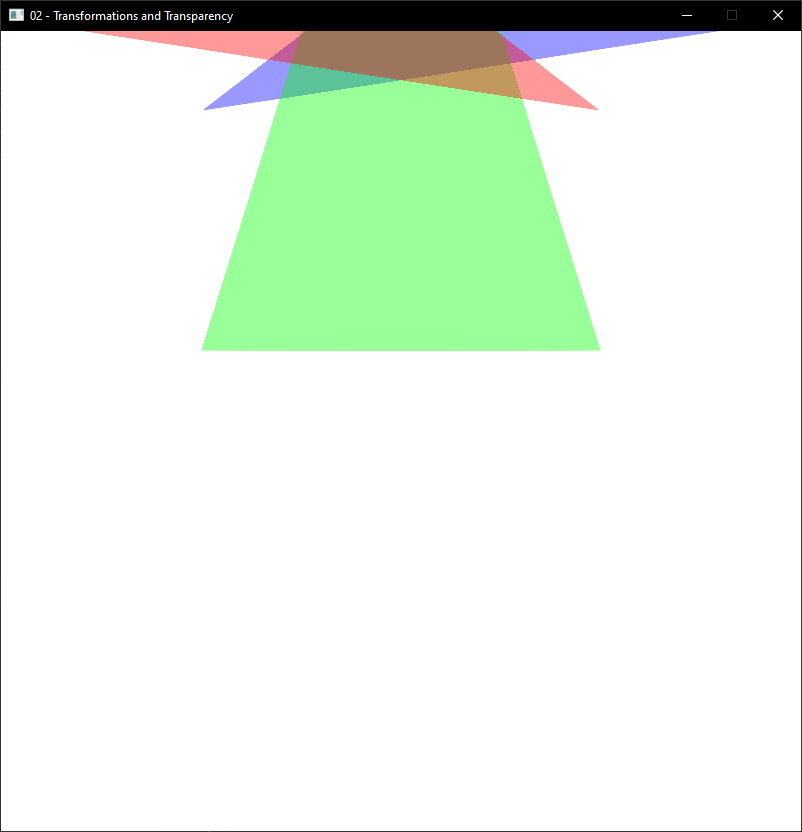|


Based on the images, and the animated effects, the transformations are as follows (scale, translate, rotate, Shear):

- **a**: Scaling along the x-axis.
- **b**: Shearing along the x-axis.
- **c**: Translation along the x-axis.
- **d**: Shearing along the y-axis
- **e**: Scaling along the y-akis.
- **f**: Translation along the y-axis.

#### **c)**
***Why can you be certain that none of the transformations observed were rotations?***

First of all we cannot have a rotation when changing a single value, we can see this from the rotation matrices where you always have a +/-sin(angle) and +/-cos(angle). When viewing the transformations as animations we also notice how even though some of them might look like rotations when viewed from the z-axis, we never observe any seperation between the triangles (they are spaced 0.5 away from each other, so if there were any rotation around the x- or y-axis we would have to see the triangles shift relative position to eachother.). We dont observe any rotation around the z-axis either (the closest would be **b** and **d**).

---

## Task 4: Combinations of Transformations

#### **a)**
*Passing transformation matrix to the shader through a uniform variable*

Changing the vertex shader to receive the variable:
```rust
layout(location=1) in vec3 position;

uniform mat4x4 affine_transformation_matrix; 

void main() 
{ 
  gl_Position =  affine_transformation_matrix * vec4(position, 1.0f);
}
```

I can now pass the identity matrix to the shader like this:

```rust
let affine_transformation_matrix: glm::Mat4 = glm::identity();

unsafe {
    gl::UniformMatrix4fv(
        shader.get_uniform_location("affine_transformation_matrix"),
        1,
        0,
        affine_transformation_matrix.as_ptr(),
    );
}
```

#### **b)**

Creating the perspective matrix:
```rust
let ratio = window::WINDOW_HEIGHT as f32 / window::WINDOW_WIDTH as f32;
let perspective: Mat4 = perspective(ratio, 1.0, 1.0, 100.0);
let perspective_translation: Mat4 = translation(&vec3(0.0, 0.0, -2.0));
```

In order for the blending to still work i now had to reverse the order i draw the triangles again. In addition to this i also reversed the indices and am drawing the backside as well (also here from back to front). This way when i move the camera around the triangles are always rendered and blended properly. 

Below is how the scene looks now with perspective, we can see that the closest triangle is now the blue one, and because of the perspective transformation, it now appears larger then the red one (even though they are the same size).

<p align="center">
  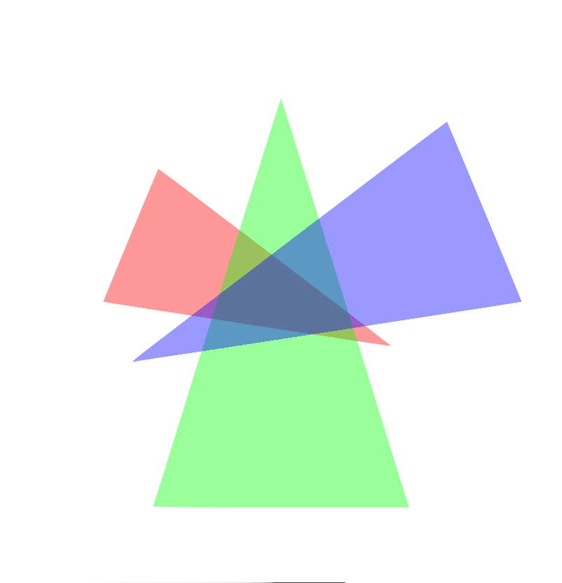
</p>

#### **c)**
*The objective of this task is to implement a camera which behaves like one standing on a tripod. It should be possible to move the tripod along each major axis, as well as being able to rotate it horizontally and vertically.*

***For each of these motions, do the following:***

##### *i)*
*Create a variable which can store the value of the motion.*

Initially i just used a vector with three floats (and i still do), but i have created a Camera Struct to handle all the camera data and movements. The Camera struct contains two vectors, one for the cameras position, and one for the relative rotation angles along each axis.

##### *ii)*
*Add a key press handler for controlling the motion. You will need two keys every time; one to control the forward direction of the motion, and one for the reverse.*

All key-press handling happens in the **keyboard.rs** file. (except for *escape* which closes the window and is located in the **window.rs** file). I also made the mouse responsible for rotating the camera. This is handled in **mouse.rs**.

### Keybindings:

- **W** = move Forward
- **A** = move Left
- **S** = move Backwards
- **D** = move Right
- **Space** = move Up
- **LShift** = move Down

To look around (rotate the camera) without using the mouse the arrowkeys can be usde like this:

- **↑** = tilt Up
- **↓** = tilt Down
- **←** = tilt Left
- **→** = tilt Right

##### *iii)* and *iv)*
*Every frame, generate a transformation matrix which applies the effect of the motion on your scene.*

Creating the entire transformation matrix goes like this:
```rust
let identity: Mat4 = glm::identity();
// Translation of scene based on camera position
let world_translation: Mat4 = translation(&(-camera.position));
// Rotation based on cameras angle
let camera_pitch_rotation: Mat4 = rotation(camera.pitch(), &vec3(1.0, 0.0, 0.0));
let camera_yaw_rotation: Mat4 = rotation(camera.yaw(), &vec3(0.0, 1.0, 0.0));
let world_rotation: Mat4 = camera_pitch_rotation * camera_yaw_rotation;
// Translation to enable perspective
let ratio = window::WINDOW_HEIGHT as f32 / window::WINDOW_WIDTH as f32;
let perspective: Mat4 = perspective(ratio, 1.0, 1.0, 100.0);
let perspective_translation: Mat4 = translation(&vec3(0.0, 0.0, -2.0));
// Merge and return resulting matrix
return perspective * world_rotation * world_translation 
        * perspective_translation * identity;
```

---

## Optional Bonus Challenges


#### **a)**
All the calculations described in this task is located in the ***camera.rs*** file. However i do believe the best cause if action is to just test the movments and make sure they feel appropriate. 

The only difference from task 4 is instead of using either the x-, y- and z-axis to move the camera around i now calculate the direction the camera is pointing and use that to determine what "forward/backward" and "right/left" means. (i kept "up/down") the same because the controls felt wierd if you moved diagonally when trying to move upwards.

To get the direction of the camera i use:
```rust
pub fn get_direction(&self) -> glm::TVec3<f32> {
    let pitch = self.rotation[PITCH];
    let yaw = self.rotation[YAW] + (PI / 2.0);

    let xz_len = pitch.cos();
    let x = xz_len * yaw.cos();
    let y = pitch.sin();
    let z = xz_len * yaw.sin();

    let mut direction = glm::vec3(x, y, z);
    direction = glm::normalize(&direction);
    return direction;
}
```
Initially this gives the vector (0, 0, -1).

I the use this when moving to determine the directions. Moving forward/backward goes directly in the vectors direction, byr right/left is adjusted a bit to keep the y-value constant.
```rust
let camera_direction = self.get_direction();
// take cameras direction and ignore y-value 
// (moving right/left maintains the same altiditude)
let xz_forward_direction: glm::TVec3<f32> = glm::vec3(
  camera_direction.x, 
  0.0, 
  camera_direction.z
);
// rotate vector 90 degrees to the right (around y-axis), to move 
// right instead of forwards
let direction = glm::rotate_vec3(
  &xz_forward_direction, 
  PI / 2.0, 
  &glm::vec3(0.0, 1.0, 0.0)
);
```

And finally i have this function that moves the cameras position in a given direction the given distance:
```rust
fn move_position(
    &mut self,
    mut direction: glm::TVec3<f32>,
    distance: f32,
) {
    direction = glm::normalize(&mut direction);
    self.position.x += direction.x * distance;
    self.position.y += direction.y * distance;
    self.position.z += direction.z * distance;
}
```
