# Shiny Scenes

<p align="center">
    
</p>

Individual tasks of the previous two assignments have asked you to implement various pieces of functionality necessary to render a 3D scene. That is, a function to create Vertex Array Objects, the implementation of a controllable camera with an appropriate projection, and the corresponding Vertex and Fragment Shaders.

In this assignment, we’re going to put all of that to use, and create a scene that’s far closer to something you might find in a modern video game! For starters, we’ll be drawing models with far more triangles than the dozen or so you’ve been drawning thus far. Next, we’ll implement some very simple lighting, and finally we’ll animate the models using a data structure found in every single major game engine out there, known as a “**Scene Graph**”.

The scene consists of lunar terrain and a helicopter. We’ll – quite literally – make this thing fly.

## Task 1: More polygons than you can shake a stick at

### *a) Loading the terrain model*

Loading the `lunarsurface.obj` file:
<p align="center">
    
</p>

### *b) Finding normals*

Adding in **initialize_vao**:

```rust
let mut normals_id: u32 = 0;
gl::GenBuffers(1, &mut normals_id);
gl::BindBuffer(gl::ARRAY_BUFFER, normals_id);
gl::BufferData(
    gl::ARRAY_BUFFER,                  // Target
    util::byte_size_of_array(normals), // Size
    util::pointer_to_array(normals),   // Data
    gl::STATIC_DRAW,                   // Usage
);

let normal_attribute_index: u32 = 3;
let nr_of_normal_values = 3;
gl::VertexAttribPointer(
    normal_attribute_index,                       // Index
    nr_of_normal_values,                          // Size
    gl::FLOAT,                                    // Type
    gl::FALSE,                                    // Normalized
    util::size_of::<f32>() * nr_of_normal_values, // Stride
    util::offset::<c_void>(0),                    // Offset
);
gl::EnableVertexAttribArray(normal_attribute_index);
```

The function is now used as follows:

```rust
initialize_vao(&terrain.vertices, &terrain.indices, &terrain.normals, &terrain.colors);
```

### *c) Passing normals to the fragment shader*

In **simple.vert**:

```rust
layout(location=3) in vec3 in_normal;
layout(location=3) out vec3 out_normal;

out_normal = in_normal;
```

In **simple.frag**:

```rust
layout(location=3) in vec3 normal;

color = vec4(normal, 1.0);
```

<p align="center">
    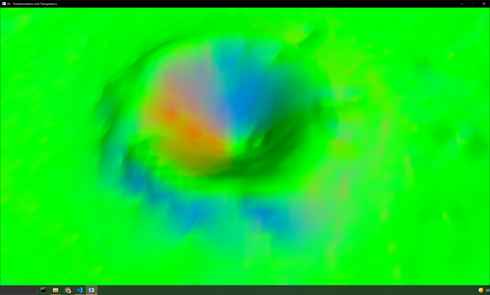
</p>

### *d) Using a lightsource*

```rust
vec3 light_direction = normalize(vec3(0.8, -0.5, 0.6));

float light = max(0.3, dot(normal, -light_direction));

color = vec4(in_color.rgb * light, in_color.a);
```

<p align="center">
    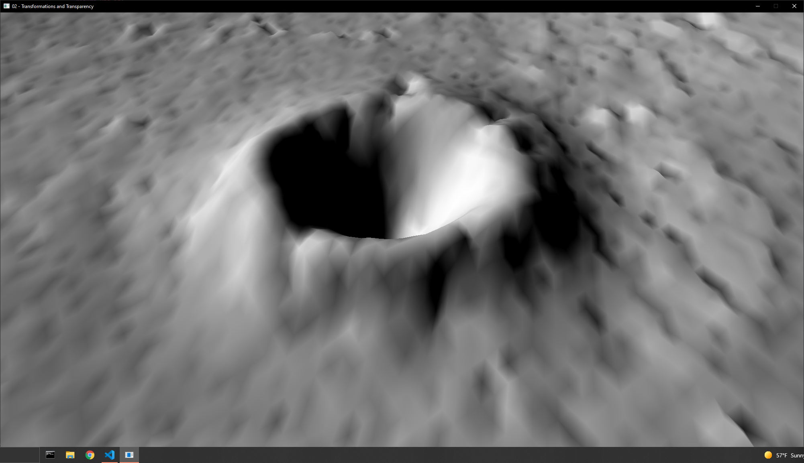
</p>

## Task 2: Helicopter Parenting

### *a) Loading the helicopter model*

<p align="center">
    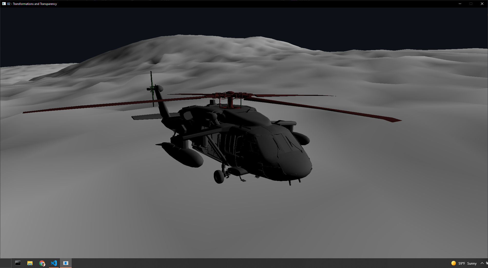
</p>

### *b) Creating the Scene Graph*

```rust
root_node.add_child(&terrain_node);
terrain_node.add_child(&heli_body);
heli_body.add_child(&heli_rotor);
heli_body.add_child(&heli_tail);
heli_body.add_child(&heli_door);
```

### *c) Using the Scene Graph to draw*

<p align="center">
    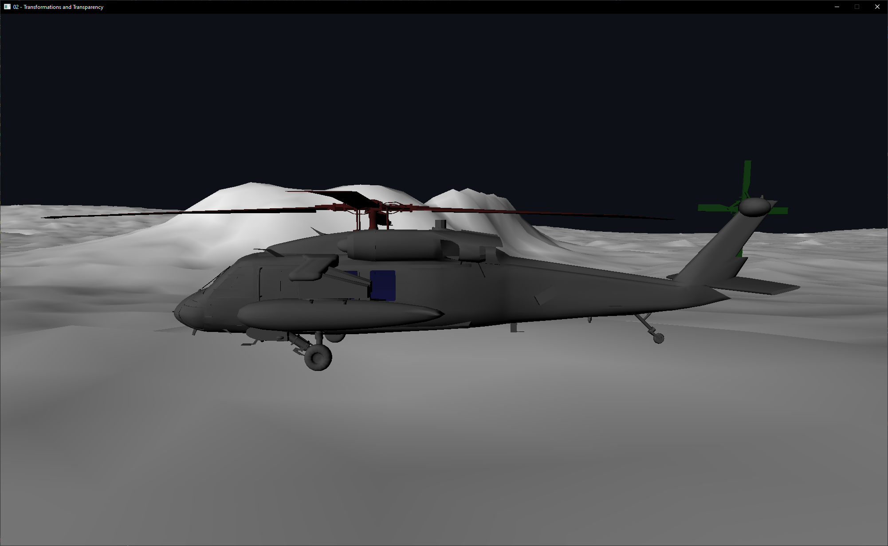
</p>

## Task 3: The (Model) Matrix: Revolutions

### *a) Traversing the Scene Graph*

```rust
pub unsafe fn draw(
    node: &SceneNode,
    view_projection_matrix: &glm::Mat4,
    mvp_matrix_location: i32,
    model_matrix_location: i32,
) {
    if node.index_count > 0 {
        let mvp_transformation_matrix = view_projection_matrix * node.current_transformation_matrix;
        gl::UniformMatrix4fv(mvp_matrix_location, 1, 0, mvp_transformation_matrix.as_ptr());
        gl::UniformMatrix4fv(model_matrix_location, 1, 0, node.current_transformation_matrix.as_ptr());
        draw_vao(node.vao_id, node.index_count);
    }

    for &child in &node.children {
        draw(&*child, view_projection_matrix, mvp_matrix_location, model_matrix_location);
    }
}
```

### *b) Setting reference points*

I am actually only changing the reference point of the tail rotor, all others can stay the same.

```rust
let mut heli_tail = SceneNode::from_vao(
    initialize_vao(&heli.tail.vertices, &heli.tail.indices, &heli.tail.normals, &heli.tail.colors),
    heli.tail.index_count,
);
heli_tail.reference_point = glm::vec3(0.35, 2.3, 10.4);
```

### *c) Computing the Transformation Matrix*

```rust
pub unsafe fn update_node_transformations(node: &mut SceneNode, parent_transformation: &glm::Mat4) {
    // Scaling
    let scale: Mat4 = scale(&glm::identity(), &node.scale);
    // Rotation
    let pitch: Mat4 = rotation(node.rotation.x, &vec3(1.0, 0.0, 0.0));
    let yaw: Mat4 = rotation(node.rotation.y, &vec3(0.0, 1.0, 0.0));
    let roll: Mat4 = rotation(node.rotation.z, &vec3(0.0, 0.0, 1.0));
    let rotation = yaw * roll * pitch;
    // Translation
    let reference_translation = translation(&node.reference_point);
    let negative_reference_translation = translation(&-node.reference_point);
    let translation: Mat4 = translation(&node.position);

    // Construct the new matrix
    let mut my_matrix: Mat4 = glm::identity();
    my_matrix = negative_reference_translation * my_matrix;
    my_matrix = scale * my_matrix;
    my_matrix = rotation * my_matrix;
    my_matrix = reference_translation * my_matrix;
    my_matrix = translation * my_matrix;

    //Update the current transformation
    node.current_transformation_matrix = parent_transformation * my_matrix;

    for &child in &node.children {
        update_node_transformations(&mut *child, &node.current_transformation_matrix);
    }
}
```

### *d) Combining the View Projection Matrix with the Transformation Matrix*

```rust
let mvp_transformation_matrix = view_projection_matrix * node.current_transformation_matrix;
```

## Task 4: Spinning into gear

For my own convenience i created a new struct that handles everything for the helicopter (HelicopterNode). It contains all SceneNodes and functions for updating positions and states.

### *a) Turning on the helicopters engine*

```rust
pub fn spin_rotors(&mut self) {
    self.main_rotor.rotation.y = (self.main_rotor.rotation.y + 1.0) % (2.0 * PI);
    self.tail_rotor.rotation.x = (self.main_rotor.rotation.y + 2.0) % (2.0 * PI);
}
```

It doesn't really work to put animations in a pdf, so i guess you just have to trust me when i say that it works

### *b) Taking the choppa for a spin (around the block)*

Apllying the heading from **toolbox.rs**:

```rust
pub fn set_heading(&mut self, heading: &util::Heading) {
    self.body.position.x = heading.x;
    self.body.position.z = heading.z;
    self.body.rotation.x = heading.pitch;
    self.body.rotation.y = heading.yaw;
    self.body.rotation.z = heading.roll;
}
```

This is apllied to the helicopter(s) like this:

```rust
let heading = toolbox::simple_heading_animation(elapsed);
helicopter.set_heading(&heading);
```

## Task 5: Help! My lighting is wrong

### *a) Yep, something is wrong here*

The lighting is, in fact, wrong.

As stated in the task this is because our normals never change when moving the objects. We can see this below because the helicopter is always bright on the left side and dark on the right side no matter the orientation of the helicopter.

<p align="center">
    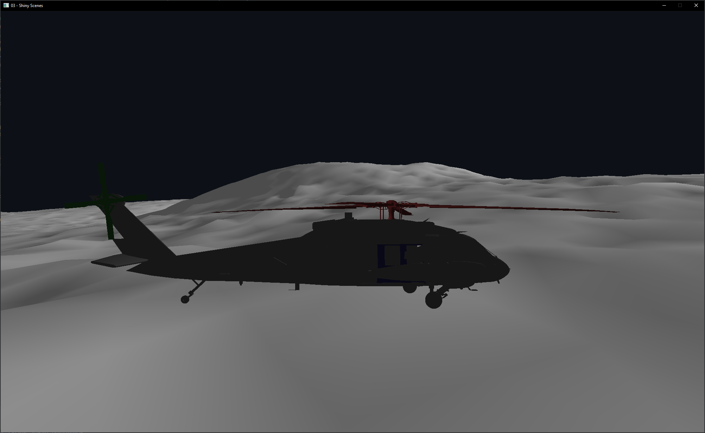
    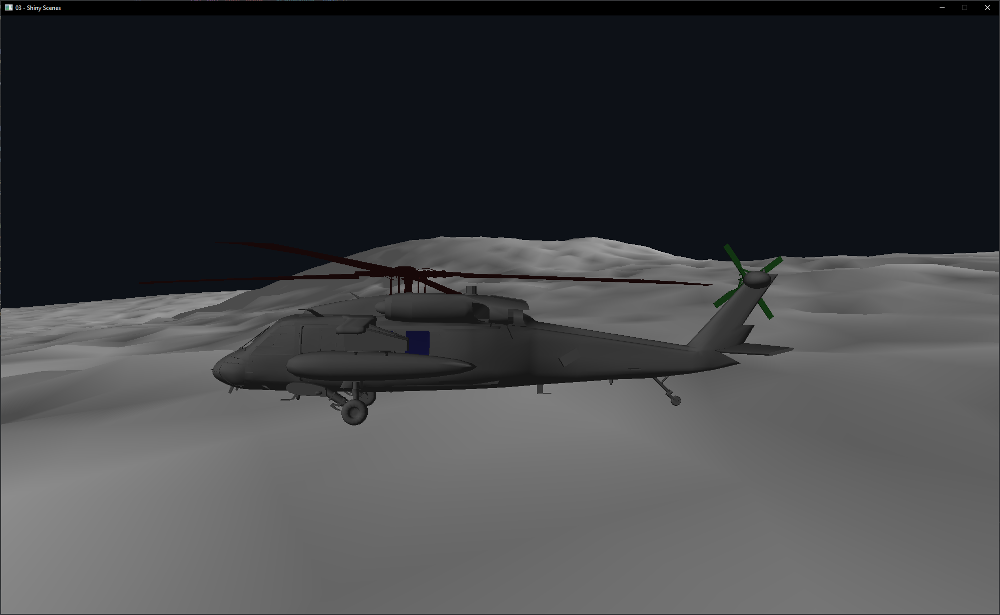
</p>

### *b) Changing the norm*

Passing the model transformation matrix to the sahder so we can apply the same transformations to the normals:

```rust
gl::UniformMatrix4fv(mvp_matrix_location, 1, 0, mvp_transformation_matrix.as_ptr());
gl::UniformMatrix4fv(model_matrix_location, 1, 0, node.current_transformation_matrix.as_ptr());
```

### *c) Getting normalized*

```rust
out_normal = normalize(mat3(model_transformation_matrix) * in_normal);
```

We can see that when we rotate the helicopter as we did before it is now properly shaded even when it is rotated.

<p align="center">
    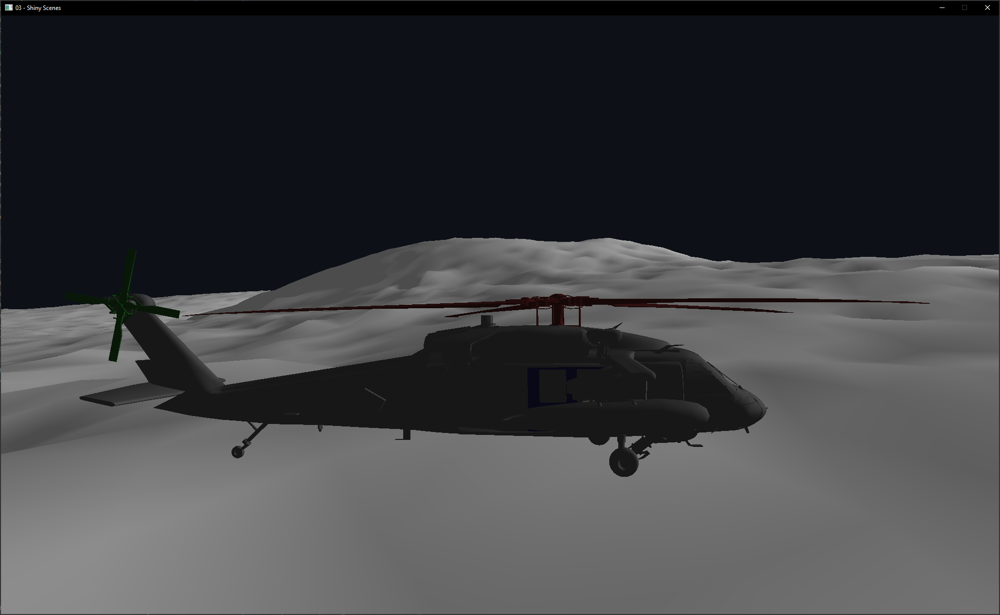
    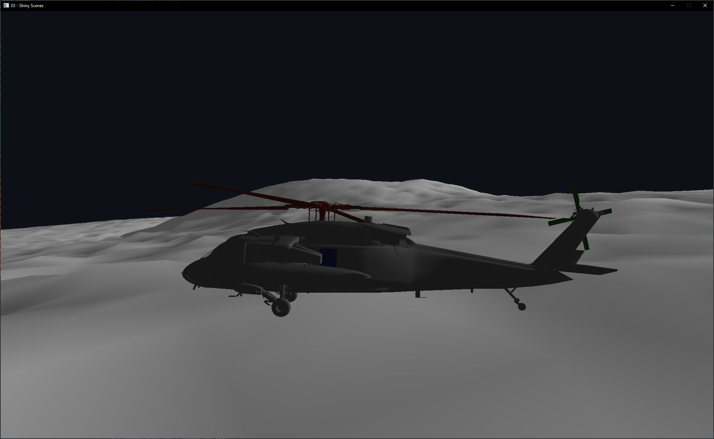
</p>

## Task 6: Time to turn this thing up to ~~11~~ 5

### *a) Is that "Flight of the Valkyries" i hear in the distance?*

I simply create a vector with 5 helicopters and loop over this vector in the main loop.

```rust
for (i, heli) in helicopters.iter_mut().enumerate() {
    heli.set_heading(&util::simple_heading_animation(elapsed + 1.5 * i as f32));
    heli.spin_rotors();
}
```

<p align="center">
    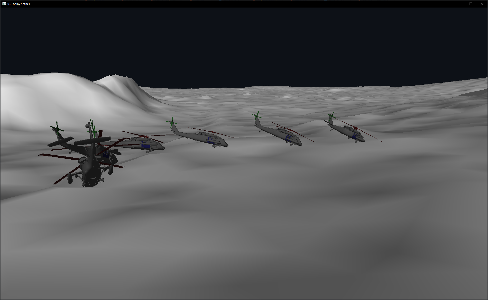
    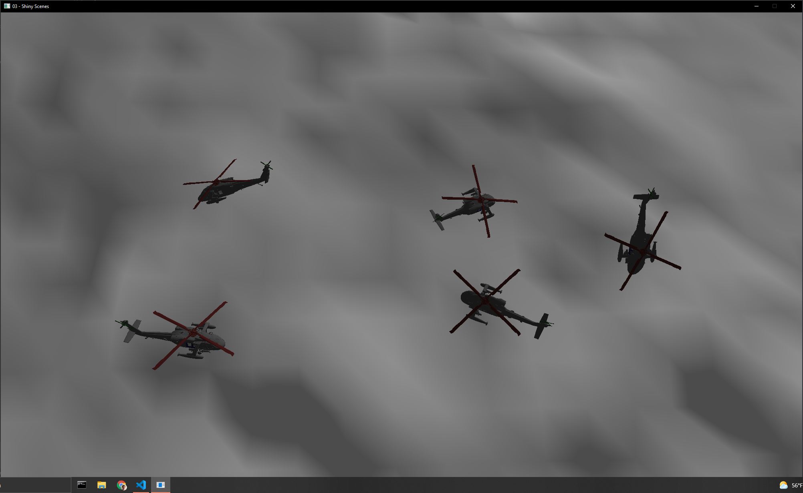
</p>

## Optional Challenges

### *b) Make one of the helicopters controllable*

Controls:

- **W** Tilt forward
- **A** Tilt left
- **S** Tilt backaward
- **D** Tilt right
- **Q** = Turn left
- **E** = Turn right
- **Space** = Increase throttle
- **LShift** = Decrease throttle
- **↑ - arrow key** = Turn engine on
- **↓ - arrow key** = Turn engine off
- **Mouse** rotate camera around the helicopter

### *c) Implement a chase camera*

The camera is implemented as a thrid-person camera following the helicopter. In addition to that you can also adjust the position of the camera relative to the helicopter using the mouse.

### *d) Open the door*

Controls (arrow keys):

- **←** = Open door
- **→** = Close door

<p align="center">
    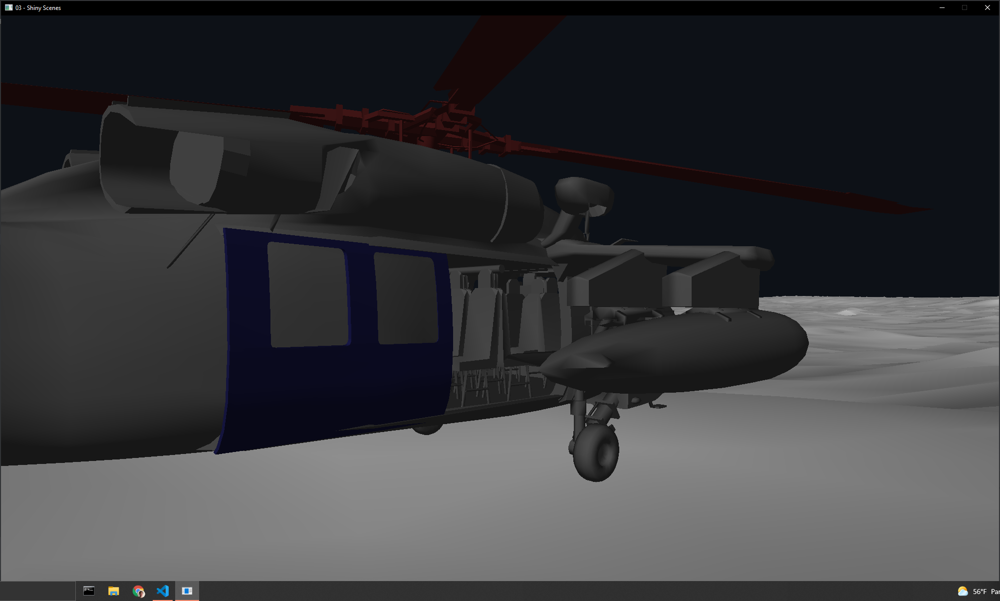
</p>
<p align="center">
    
</p>

### *f) Find the easter egg*

The cake is a lie!
<p align="center">
    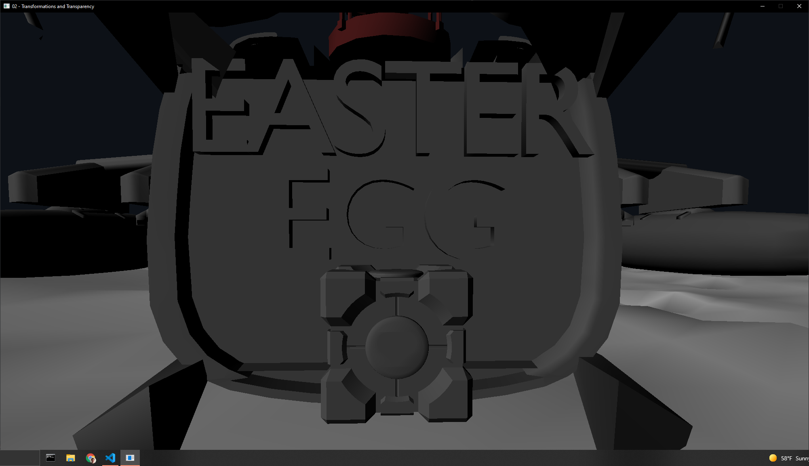
</p>

### *g) Impress us!*

I spent the time i had available creating a basic, but realistic set of controls/physics for the helicopter.

- The helicopter uses the direction and speed of the main rotor to determine its moving-direction and distance
- When turning/moving forwards the helicopter tilts and loses downforce, this means you should increase the throttle when making hard titls to avoid falling to the ground.
- When you let go of the keys the helicopter will gradually align itself horizontally and hover in place.  
- You need to turn the engine on and wait for the rotor's speed to reach the point where it actually lifts the helicopter off the ground before you are able to move.
- Turning the engine off mid-flight will cause the helicopter to slow down and eventually fall towrds the surface (it will automatically stop at y=0).
  
This is best experienced by running the code yourself, but i will also upload a short gif demonstrating the behaviour.

<p align="center">
    
    
    
</p>

> Note that it might look like the rotors stop spinning while in the air (mainly when increasing throttle), this is actually NOT due to my code, but because the rotorspeed ligns up with the framerate making it only appear as though it isnt moving (just like when recording helicopters in real life).