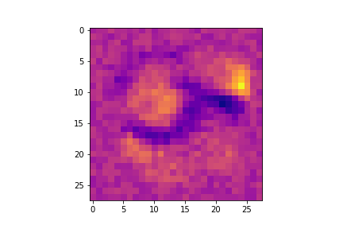

\clearpage
# Task 1 - Spatial Filtering {-}

## (a) {-}
Sampling is converting a continous signal into a discrete signal, for instance digitizing a physical photo to virtual pixels.

## (b) {-}
Quantization is mapping the values from the sampling to discrete values in a certain range, for instance to 8 bit color values.

## (c) {-}
By looking at an image histogram, you can identify the contrast level in the distribution of the values. An image with high contrast will have near linear cumulative histogram.

## (d) {-}

[@fig:t1d] shows histogram equalization performed manually.

{#fig:t1d}

## (e) {-}
If we apply a log transform to an image with a large variance in pixel intensities the dynamic range will be compresses. This is because the log transform will map low values to a wider range, and high values to a smaller range.

## (f) {-}

The convolution is visualized in [@fig:t1f], the multiplications and additions are not written out. The explanation part visualizes with colors how the values from the flipped kernel, and the respective area in the original image is multiplied and then summed together.

{#fig:t1f}

\clearpage
# Task 2 - The Lake {-}

## (a) {-}

{#fig:t2a width=50%}

## (b) {-}

{#fig:t2b width=50%}

## (c) {-}

{#fig:t2c2 width=40%}
{#fig:t2c1 width=40%}

The lake after applying the kernels.

\clearpage
# Task 3 -  Neural Networks {-}

## (a) {-}
An example of what a single-layer neural network cannot represent is **XOR**. This is because XOR requires a non-linear function.

## (b) {-}
A hyperparameter is a parameter that defines the network in itself, or how it is trained. This can for instance be the number of layers, number of units per layer, learning rate etc.

## (c) {-}
Softmax is used to create a discrete probability distribution. This means that in the end the network has a number of values (between 0 and 1) that always add up to 1. This makes sure the model isn't thrown off by suddenly getting an extremely high value (that will make big changes in back propagation).

## (d) {-}

Performing forward pass on the network yields the following result ([@fig:t3d1]):

{#fig:t3d1}

After that we can compute the final value of $C$ and calculate the backwards pass.
Using notation: $\frac{\vartheta C}{\vartheta x_n}=x_n'$

We have that: $y=1$ and $C(y_n, \hat{y}_n)=\frac{1}{2}(y_n - \hat{y}_n)^2$ In other words we get:

$$C=\frac{1}{2}(y - \hat{y})^2=\frac{1}{2}(1 - 2)^2=\frac{1}{2}$$

From this ($C=\frac{1}{2}$) we get the following values:
$$\begin{aligned}
    \hat{y}'&=-\hat{y}\cdot\frac{1}{2}(y - \hat{y})               &= -2\cdot\frac{1}{2}(1 - 2) &=1\\
        c_1'&=\hat{y}'\cdot\frac{\vartheta\hat{y}}{\vartheta c_1}&= 1\cdot1     &= 1\\
        c_2'&=0                                                  &              &\text{ since $C=max(c_1, c_2)$ and $c_1 > c_2$ }\\
        b_1'&=c_1'\cdot\frac{\vartheta c_1}{\vartheta b_1}       &= 1\cdot 1    &= 1\\
        b_2'&=c_2'\cdot\frac{\vartheta c_2}{\vartheta b_2}       &= 0\cdot 1    &= 0\\
        a_1'&=c_1'\cdot\frac{\vartheta c_1}{\vartheta a_1}       &= 1\cdot 1    &= 1\\
        a_2'&=c_1'\cdot\frac{\vartheta c_1}{\vartheta a_2}       &= 1\cdot 1    &= 1\\
        a_3'&=c_2'\cdot\frac{\vartheta c_2}{\vartheta a_3}       &= 0\cdot 1    &= 0\\
        a_4'&=c_2'\cdot\frac{\vartheta c_2}{\vartheta a_4}       &= 0\cdot 1    &= 0\\
        w_1'&=a_1'\cdot\frac{\vartheta a_1}{\vartheta w_1}       &= 1\cdot X_1  &=-1\\
        w_2'&=a_2'\cdot\frac{\vartheta a_2}{\vartheta w_2}       &= 1\cdot X_2  &= 0\\
        w_3'&=a_3'\cdot\frac{\vartheta a_3}{\vartheta w_3}       &= 0\cdot X_3  &= 0\\
        w_4'&=a_4'\cdot\frac{\vartheta a_4}{\vartheta w_4}       &= 0\cdot X_4  &= 0\\
\end{aligned}$$

Which leaves us with the following network in [@fig:t3d2]:

{#fig:t3d2}

## (e) {-}

Updating the weights with $\alpha=0.1$:

$$\begin{aligned}
    w_1&= w_1 - \alpha\cdot w_1'&=-1-0.1\cdot-1&=-0.9 \\
    w_3&= w_3 - \alpha\cdot w_3'&=-1-0.1\cdot0&=-1   \\
    b_1&= b_1 - \alpha\cdot b_1'&=1-0.1\cdot1&=0.9  \\
\end{aligned}$$

\clearpage
# Task 4 - MNIST {-}

## (a) {-}

{#fig:t4a}

In Figure [@fig:t4a] we see how the normalized images makes the model learn more quickly (as seen by the quick decrease in loss). Normalizing makes sure that all the images contain the same color-ranges, this consistency makes it easier for the model to recognize repeating patterns.

|                       | Accuracy | Cross-Entropy Loss |
| :-------------------- | :------: | :----------------: |
| Without Normalization |   0.91   |        0.34        |
| With Normalization    |   0.91   |        0.29        |
| Difference            | +0.0044  |      -0.0416       |
: Accuracy and Cross-Entropy Loss With and Without Normalization. {#tbl:t4a-tbl}

## (b) {-}

The weights are as seen below:

{#fig:t4b0 width=30%}

{#fig:t4b1 width=30%}
{#fig:t4b2 width=30%}
{#fig:t4b3 width=30%}

{#fig:t4b4 width=30%}
{#fig:t4b5 width=30%}
{#fig:t4b6 width=30%}

{#fig:t4b7 width=30%}
{#fig:t4b8 width=30%}
{#fig:t4b9 width=30%}

Model Weights After Training

What we are observing here is a kind of "heatmap" of where, for each of the 10 output variables, the weights put emphasis in the picture. For [@fig:t4b1] (Number 1), we can clearly see how the model highly favors pixels in the middle, while for  [@fig:t4b0] (Number 0), it favors pixels NOT in the middle.

## (c) {-}

The results with learning rate of 1.0 is shown in figure [@fig:t4c]. The Learning rate tells the model how quickly it should change its values based on the results. We clearly see how the loss is moving wildly up and down. This is because the learning rate is too high and causes overfitting, where the model cannot converge on an optimal value because it changes too much.

{#fig:t4c}

| Accuracy | Cross-Entropy Loss |
| :------: | :----------------: |
|   0.89   |        2.21        |
: Final Accuracy and Cross-Entropy Loss with Learning Rate = 1.0 {#tbl:t4c}

## (d) {-}

{#fig:t4d}

| Accuracy | Cross-Entropy Loss |
| :------: | :----------------: |
|   0.94   |        0.21        |
: Final Accuracy and Cross-Entropy Loss With Hidden Layer {#tbl:t4d}

Comparing this directly to the loss and accuracy of the normalized model in Task A ([@tbl:t4a-tbl]), gives us:

| Accuracy | Cross-Entropy Loss |
| :------: | :----------------: |
| +0.0268  |      -0.0885       |
: Difference in Accuracy and Cross-Entropy Loss for Task D and Task A {#tbl:t4d-diff}

From the graph and the difference we see how the model with the hidden layer outperforms the model without it. It seems like the hidden layer allows the model to store more nuanced data (be more sensitive for small changes), where as in Task A the model quickly plateaus because of a lack of nodes.
