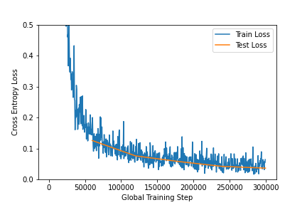
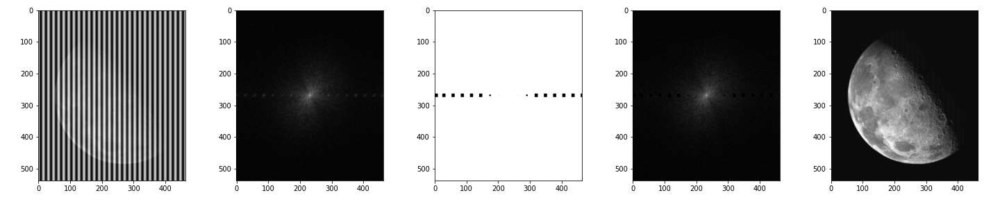
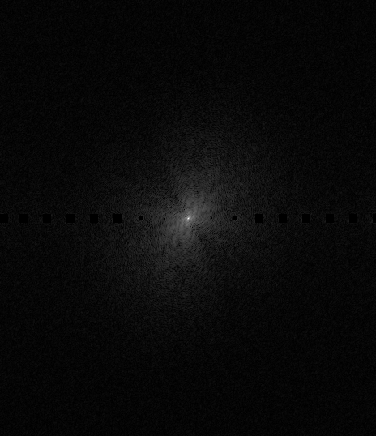

\clearpage
# Convolutional Neural Networks
## Task 1 - Theory

### (a)
We have:
$$\begin{aligned}
    \text{kernel}&=F_H\times F_W&&=5\times5\\
    \text{stride}&=S_H\times S_W&&=1\times1\\
    \text{filters}&             &&=6\\
    \text{Width out = Width in}&\rightarrow W_1=W_2&&=W\\
    \text{Height out = Height in}&\rightarrow H_1=H_2&&=H\\
\end{aligned}$$

To find the Padding in Width ($P_W$) and Height ($P_H$), we use equation 1 and 2 from the assignment. This gives us:

$$\begin{aligned}
    W_2 &=\frac{W_1 - F_W +2P_W}{S_W} + 1\\
    W &=\frac{W - F_W +2P_W}{S_W} + 1\\
    S_W(W-1) &=W - F_W + 2P_W\\
    S_W(W-1)-W + F_W &= 2P_W\\
    P_W&=\frac{S_W(W-1)-W + F_W}{2}\\
    P_W&=\frac{W-1-W + 5}{2}\\
    \bm{P_W}&=\frac{4}{2}=\bm{2}\\\\
    &\text{and}\\\\
    P_H&=\frac{S_H(H-1)-H + F_H}{2}\\
    P_H&=\frac{H-1-H + 5}{2}\\
    \bm{P_H}&=\frac{4}{2}=\bm{2}\\
\end{aligned}$$

We see that we should use a padding of $P_H\times P_W=2\times2$.

\clearpage
### (b)

We know that:
$$\begin{aligned}
    \text{size of original image}&=H_1\times W_1=512\times512\\
    \text{number of layers}&=2\\
    \text{spatial dimensions of the feature maps in the first layer}&=H_2\times W_2=504\times504\\
    \text{number of feature maps in the first layer}&=12\\
\end{aligned}$$

And we are told that we can assume:

$$\begin{aligned}
    \text{kernels}&=N\times N &&\text{where $N$ is odd}\\
    \text{stride}&=S_H\times S_W&&=1\times1\\
    \text{padding}&=P_H\times P_W&&=0\times0\\
\end{aligned}$$

Again, using the equations from the assignment, we get for the first layer that:

$$\begin{aligned}
    W_2 &=\frac{W_1 - F_W +2P_W}{S_W} + 1\\
    S_W(W_2-1)-W_1- 2P_W&=-F_W\\
    F_W &=-S_W(W_2-1)+W_1+ 2P_W\\
        &= -1(504-1)+512+ 2*0 \\
        &= -504+1+512 \\
        &= 9 \\
    \\
    \text{and}\\
    \\
    F_H &=-S_H(H_2-1)+H_1+ 2P_H\\
        &= -1(504-1)+512+ 2*0 \\
        &= -504+1+512 \\
        &= 9 \\
\end{aligned}$$

In other words, we get a kernel size in layer 1 of:

$$\begin{aligned}
    F_H &\times F_W \\
    \bm{9} &\times \bm{9} \\
\end{aligned}$$

\clearpage
### (c)

We have that:

$$\begin{aligned}
    \text{Input} &= H_1\times W_1 = 504\times504\\
    \text{Stride} &= S_H\times S_W=2\times2 \\
    \text{Subsampling Window Size} &=F_H\times F_W= 2\times2 \\
    \text{Padding} &=P_H\times P_W= 0\times0 \\
\end{aligned}$$

We get that the spatial dimensions of the pooled feature maps are:

$$\begin{aligned}
    H_2 &\times W_2 \\
    \frac{H_1-F_H+2P_H}{S_H}+1&\times\frac{W_1-F_W+2P_W}{S_W}+1\\
    \frac{504-2+2*0}{2}+1&\times\frac{504-2+2*0}{2}+1\\
    \frac{502}{2}+1&\times\frac{502}{2}+1\\
    \bm{252}&\times\bm{252}\\
\end{aligned}$$

### (d)

We have that:

$$\begin{aligned}
    \text{Input} &= H_1\times W_1 = 252\times252\\
    \text{Kernel Size} &=F_H\times F_W= 3\times3 \\
    \text{Stride} &= S_H\times S_W=1\times1 \\
    \text{Padding} &=P_H\times P_W= 0\times0 \\
\end{aligned}$$

Which gives us a resulting dimension of the feature maps of:

$$\begin{aligned}
    H_2 &\times W_2 \\
    \frac{H_1-F_H+2P_H}{S_H} +1 &\times \frac{W_1 -F_W +2P_W}{S_W} +1 \\
    \frac{252 -3+2*0}{1} +1 &\times \frac{252 -3+2*0}{1} +1\\
    249 +1 &\times 249 +1\\
    \bm{250} &\times \bm{250}\\
\end{aligned}$$

\clearpage
### (e)

Assuming the image has dimensions $32\times32$ and is grayscale ($32\times32\times1$), we get the following number of parameters for each layer:

| Layer |                             Weights | Biases | Parameters for layer | Total Parameters |
|:-----:|------------------------------------:|-------:|---------------------:|-----------------:|
|   n   | $F_H\times F_W\times C_1\times C_2$ |  $C_2$ |     Weights + Biases |           $\sum$ |
|       |                                     |        |                      |                  |
|   1   |        $5\times 5\times 1\times 32$ |     32 |                  832 |              832 |
|   2   |       $3\times 3\times 32\times 64$ |     64 |               18 496 |           19 328 |
|   3   |      $3\times 3\times 64\times 128$ |    128 |               73 856 |           93 184 |
|   4   |                $(4*4*128)\times 64$ |     64 |              131 136 |          224 320 |
|   5   |                       $64\times 10$ |     10 |                  650 |          224 970 |

We see that the total number of parameters in the network from descried in *Table 1* in the assignment has a total of **224 970** parameters.

\clearpage
## Task 2 - Programming

### (a)

{#fig:t2a width=70%}

I Don't see any major signs of overfitting for this model.

Overfitting is when a model gets too specialized on the training data that it no longer uses the general features to classify. This could happen if the model has too many parameters, or trains extensively on a too small training set.

From the graph we would see overfitting if the train-loss keeps decreasing while test-loss start to increase (they start to diverge).

### (b)

{#fig:t2b width=70%}

Here we actually see more signs of overfitting as we see the test-loss for "Adam" actually starts to increase again while the train-loss remains roughly the same.

### (c)

![Visualization of filters and activations in ResNet50 on "zebra.jpg". Each column visualizes the $7 \times 7$ filter (top) of the first layer, and the corresponding grayscale activation (bottom). This is done on the following indices: [5, 8, 19, 22, 34] ](../src/images/output/task2c.png){#fig:t2c width=100%}

### (d)

In [@fig:t2c] we see how the filters highlight different features in the image. Each of the filters extracts the following features:

| Filter | Feature                         | Example that has this feature  |
|-------:|:--------------------------------|:-------------------------------|
|      5 | Vertical lines                  | Stripes and edges of the Zebra |
|      8 | Diagonal Lines (Up to the left) | Striped and edges of the Zebra |
|     19 | Green Color                     | The Grass (yellow=green+red)   |
|     22 | Horizontal Lines                | Stripes and edges of the Zebra |
|     34 | Blue Color                      | The Sky                        |

\clearpage
# Filtering in the Frequency Domain
## Task 3 - Theory

### (a)

The dots in the images in the second row represent the frequency and rotation of the "waves" in the images in the first row.

Lower frequencies will have dots closer to the center of the image, and higher frequencies are closer to the outside of the image. Based only on this we can assume that the image with the lowest frequency in the first row ($1d$), will correspond to the frequency domain image with the dots closest to the center ($2b$).

In addition to this the placements of the dots signify rotation of the "waves". Where the waves will follow the direction of the dots. For instance in $1d$ we see that the waves are moving horizontally (the lines are vertical), and the dots in $2b$ are therefore also placed horizontally.

Based on this we get the following connections:

$$\begin{aligned}
1a &\rightarrow 2e\\
1b &\rightarrow 2c\\
1c &\rightarrow 2f\\
1d &\rightarrow 2b\\
1e &\rightarrow 2d\\
1f &\rightarrow 2a\\
\end{aligned}$$

### (b)

High-Pass and Low-Pass filters are filters that only allow frequencies above or below a certain cutoff frequency to pass through. Given a certain cutoff frequency High-Pass filters will only allow frequencies higher than this cutoff, and Low-Pass filters will only allow frequencies lower than it.

### (c)

Since we know that the center of image contains the lowest frequencies, and the edges contain the highest frequencies we can assume that:

- **(a)** Is a High-Pass Kernel/Filter (only allows the high frequencies not in the center to pass)
- **(b)** Is a Low-Pass Kernel/Filter (only allows the low frequencies close to the center to pass)

\clearpage
## Task 4 - Programming

### (a)

[@fig:t4a-low-process] and [@fig:t4a-high-process] visualize the following in order from left to right:

- The original image (”camera man”)
- The FFT of the image
- The kernel/filter
- The FFT of the image after applying the kernel/filter
- The image after inverting the filtered FFT

{#fig:t4a-low-process width="100%"}

{#fig:t4a-high-process width="100%"}

The subfigures in [@fig:t4a-res] show a higher resolution image of each output.

{#fig:t4a-low width="45%"}
{#fig:t4a-high width="45%"}

Convolved image after applying the filters

The "ringing" artifacts we see in the filtered image is caused by us using ideal filters. In other words the filters has a sharp edge/cutoff. The ringing does not occur with a filter with a smoother edge (like the gaussian in Task (b)). The ringing is caused by the resulting waves formed because we cut off all the higher/lower frequencies that "neutralize" this oscillation in the original image.

> *"The main cause of ringing artifacts is due to a signal being bandlimited (specifically, not having high frequencies)...  the cause of this type of ringing is the ripples in the **sinc** function which is the impulse response of a perfect low-pass filter"* ([Wikipedia](https://en.wikipedia.org/wiki/Ringing_artifacts)).

> *"By definition, ringing occurs when a non-oscillating input yields an oscillating output: formally, when an input signal which is monotonic on an interval has output response which is not monotonic."* ([Wikipedia](https://en.wikipedia.org/wiki/Sinc_filter))

\clearpage
### (b)

[@fig:t4b-gauss-process] and [@fig:t4b-sobel-process] visualize the following in order from left to right:

- The original image (”camera man”)
- The FFT of the image
- The kernel/filter
- The FFT of the image after applying the kernel/filter
- The image after inverting the filtered FFT

{#fig:t4b-gauss-process width="100%"}

{#fig:t4b-sobel-process width="100%"}

The subfigures in [@fig:t4b-res] show a higher resolution image of each output.

{#fig:t4b-gauss width="45%"}
{#fig:t4b-sobel width="45%"}

Image after applying the different filters/kernels.

\clearpage
### (c)

[@fig:t4c-process] visualizes the following in order from left to right:

- The original image
- The FFT of the image
- The created mask/filter
- The FFT of the image after applying the mask/filter
- The image after inverting the filtered FFT

{#fig:t4c-process width="100%"}

The subfigures in [@fig:t4c-res] show a higher resolution image of the FFTs to clearly see which pixels/sections where filtered out.

{#fig:t4c-orig width="45%"}
{#fig:t4c-filtered width="45%"}

FFT before and after applying the mask/filter.

Finally [@fig:t4c-moon] shows the high resolution result after filtering and normalizing the image.

{#fig:t4c-moon width="80%"}

\clearpage
### (d)
For each of the pages i find the following angles of rotation:

| Page |  Angle |
|:----:|-------:|
|  1   | -21.81 |
|  2   |  90.00 |
|  4   |  26.82 |
|  6   | -25.32 |
|  7   | -67.44 |
|  8   |  90.00 |

[@fig:t4d] shows the binary FFT, the Hough Transform and the final rotated image.

{#fig:t4d width="75%"}
