\clearpage
# Task 1 - Theory
## (a)

**Opening** is $A\circ B=(A\ominus B)\oplus B$, or in other words: Erosion followed by Dilation with the same structuring element.

**Closing** is $A\bullet B=(A\oplus B)\ominus B$, or in other words: Dilation followed by Erosion with the same structuring element.

If opening or closing is performed multiple times on the same image (using an identical structuring element), the output will remain the same.

## (b)

The purpose of smoothing an image before performing edge-detection is to remove noise that would affect the output. This is necessary because edge-detection is usually very sensitive to noise.

## (c)

*Hysteresis thresholding* works by not only using a pixels value, but also the value of pixels it is connected to determine if it should be included or not. Because of this the tresholding favors pixels connected to a big cluster of valid pixels, and disfavors pixels that are not connected to anything.

## (d)

We use *Hysteresis thresholding* instead of normal thresholding when we have images that conatin a lot of noise. This will ignore minor pathes/pixels/noise that would be included in a normal treshold that is not part of a larger cluster/object but are above the threshold, and include minor pathces/pixels/noise inside larger clusters that are below the threshold.

\clearpage
## (e)

Since the structuring element $B$ is symmetrical around its reference pixel, we have that $\hat{B}=B$, and we simply try to place the structuring element (at the reference pixel) over every pixel in the original image. If there is a hit, that pixel is set to 1, otherwise it is set to 0.

:::{#fig:t1e}
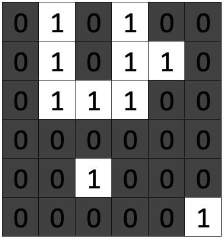{#fig:t1e-orig width=38%}\  
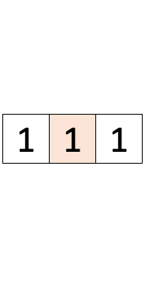{#fig:t1e-struct width=19%}\  
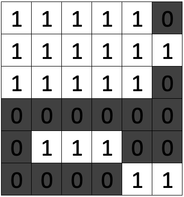{#fig:t1e-dilated width=38%}

Dilation on a $6\times6$ image where the foreground is colored white and given the symbol 1. The background has the symbol 0 and is colored black. The reference pixel in the structuring element (b) is indicated by the orange tint.
:::

\clearpage
# Task 2 - Segmentation
## (a)

:::{#fig:t2a-1}
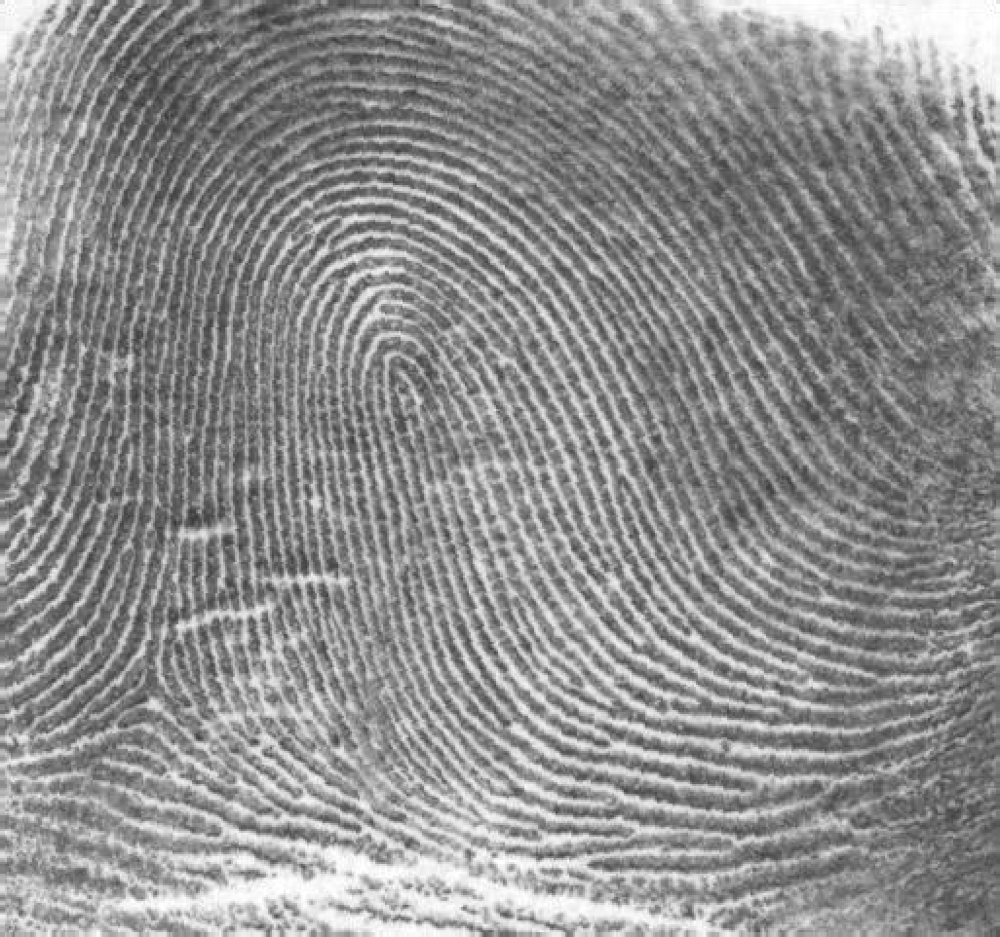{#fig:t2a-1-orig width=45%}\  
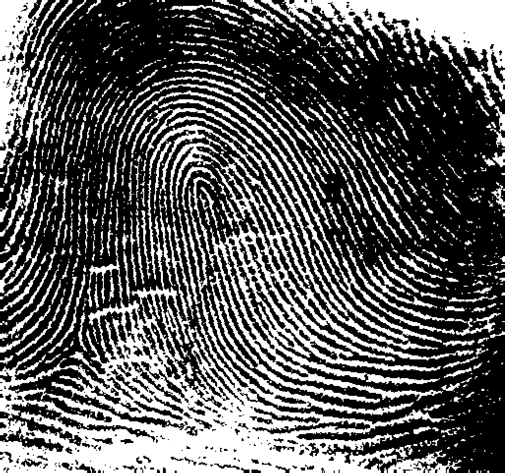{#fig:t2a-1-seg width=45%}

Applying Otsu's algorithm on *thumbprint.png* to find the optimal threshold gave a threshold of **153** with a separability measure of **0.701**.
:::

:::{#fig:t2a-2}
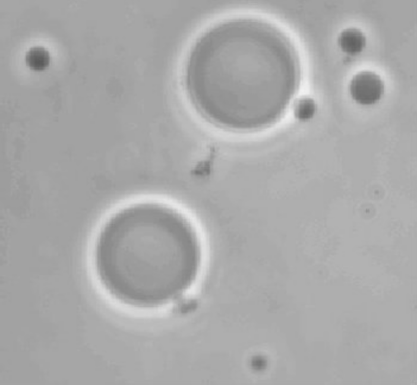{#fig:t2a-2-orig width=45%}\  
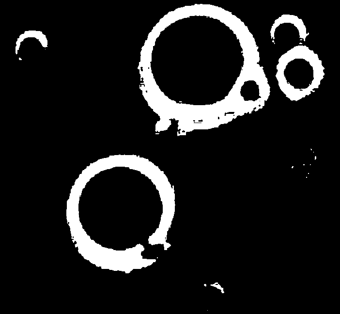{#fig:t2a-2-seg width=45%}

Applying Otsu's algorithm on *polymercell.png* to find the optimal threshold gave a threshold of **181** with a separability measure of **0.466**.
:::

\clearpage
## (b)

:::{#fig:t2b}
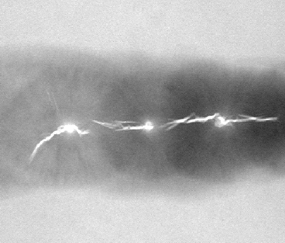{#fig:t2b-orig width=45%}\  
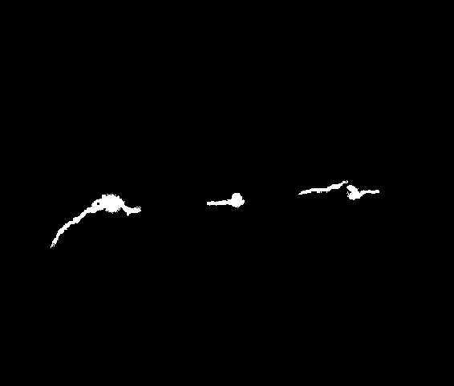{#fig:t2g-seg width=45%}

Segmentation after applying *Region Growing* using a Moore neighborhood and a threshold of 50.
:::

\clearpage
# Task 3 - Morphology
## (a)

:::{#fig:t3a}
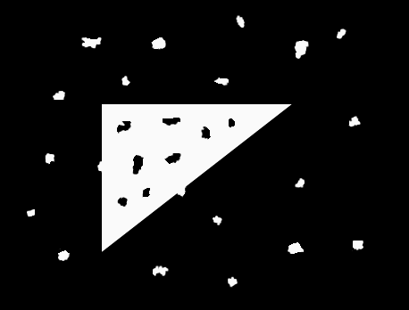{#fig:t4a1 width=45%}\  
{#fig:t4a2 width=45%}

Applying *binary_closing* and *binary_opening* to remove the noise from the original image using a disk shaped structuring element with radius of 8.
:::

## (b)

:::{#fig:t3b}
{#fig:t4b1 width=45%}\  
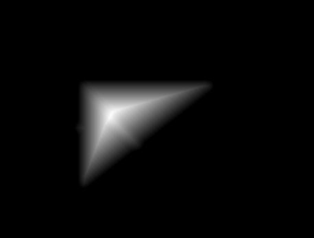{#fig:t4b2 width=45%}

Using chessboard-distance to create a distance transform on the image from Task 3(a) using a $3\times3$ structuring element of 1's.
:::

\clearpage
## (c)

:::{#fig:t3c}
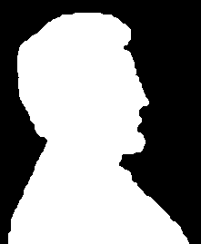{#fig:t4c1 width=45%}\  
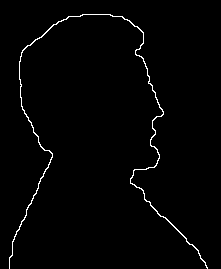{#fig:t4c2 width=45%}

Before and after applying the boundary formula $A_{boundary} = A - (A \ominus B)$ with a $3\times3$ structuring element of all 1's.
:::

## (d)

:::{#fig:t3d}
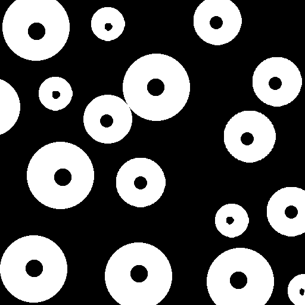{#fig:t4c1 width=45%}\  
{#fig:t4c2 width=45%}

Before and after applying the algorithm for filling holes descried in the assignment. Using 30 iterations, and a $3\times3$ structuring element of all 1’s.
:::
